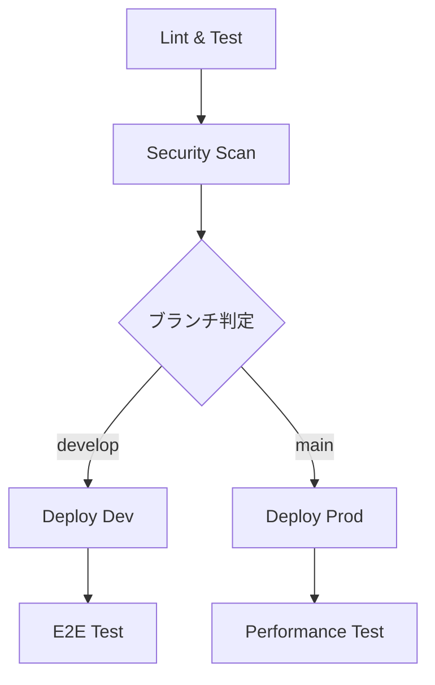

# CI/CD パイプライン ガイド

## 概要

OmniyプロジェクトのCI/CDパイプラインは、GitHub Actionsを使用してコード品質の保証、自動テスト、セキュリティスキャン、自動デプロイを実現します。

## パイプライン構成

### 1. メインCI/CDワークフロー (`ci-cd.yml`)

#### トリガー条件
- `main` ブランチへのプッシュ → 本番環境デプロイ
- `develop` ブランチへのプッシュ → 開発環境デプロイ
- プルリクエスト → 品質チェックのみ

#### ジョブフロー


#### 各ジョブの詳細

**1. Lint & Test**
- フロントエンド：ESLint、TypeScript型チェック、Vitest単体テスト
- バックエンド：ESLint、TypeScript型チェック、Jest単体テスト
- ビルド確認

**2. Security Scan**
- Trivy脆弱性スキャン
- 結果をGitHub Security tabに自動アップロード

**3. Deploy Dev (developブランチ)**
- 開発環境用の環境変数でビルド
- Firebase HostingとCloud Functionsにデプロイ
- E2Eテスト実行

**4. Deploy Prod (mainブランチ)**
- 本番環境用の環境変数でビルド
- Firebase HostingとCloud Functionsにデプロイ
- GitHubリリース自動作成

**5. Performance Test**
- Lighthouse CI実行
- パフォーマンススコア測定

### 2. プルリクエストチェック (`pr-check.yml`)

#### 機能
- 変更されたファイルのみテスト実行（効率化）
- コードカバレッジレポート
- セキュリティチェック（Semgrep）
- Firestoreルールテスト
- 依存関係脆弱性スキャン

### 3. 依存関係自動更新 (`dependency-update.yml`)

#### スケジュール
- 毎週月曜日午前9時（JST）に自動実行
- 手動実行も可能

#### 機能
- npm依存関係の自動更新
- セキュリティパッチ適用
- テスト実行後、自動でPR作成

## ブランチ戦略

### Git Flow ベース

```
main (本番環境)
├── develop (開発環境)
│   ├── feature/新機能A
│   ├── feature/新機能B
│   └── hotfix/緊急修正
└── release/v1.0.0
```

### ワークフロー

1. **機能開発**
   ```bash
   git checkout develop
   git checkout -b feature/新機能名
   # 開発作業
   git push origin feature/新機能名
   # PR作成 → develop
   ```

2. **開発環境デプロイ**
   ```bash
   # developブランチにマージ後、自動デプロイ
   ```

3. **本番リリース**
   ```bash
   # develop → main のPR作成・マージ
   # 自動で本番環境にデプロイ
   ```

## 環境設定

### 開発環境 (Development)
- Firebase Project: `omniy-dev`
- URL: `https://omniy-dev.web.app`
- 用途: 機能テスト、統合テスト

### 本番環境 (Production)
- Firebase Project: `omniy-prod`
- URL: `https://omniy-prod.web.app`
- 用途: 実際のユーザー向けサービス

## 品質ゲート

### 必須チェック項目
- ✅ ESLint エラーゼロ
- ✅ TypeScript型エラーゼロ
- ✅ 単体テスト成功
- ✅ ビルド成功
- ✅ セキュリティスキャン通過

### 推奨チェック項目
- 📊 コードカバレッジ 80%以上
- 🚀 Lighthouse スコア 90以上
- 🔒 脆弱性ゼロ

## モニタリング

### GitHub Actions
- ワークフロー実行状況の監視
- 失敗時のSlack通知（設定可能）

### Firebase
- Cloud Functions ログ監視
- Hosting パフォーマンス監視
- Firestore 使用量監視

## トラブルシューティング

### よくある問題

#### 1. ビルドエラー
```bash
# ローカルで確認
cd frontend && npm run build
cd functions && npm run build
```

#### 2. テスト失敗
```bash
# ローカルでテスト実行
cd frontend && npm run test:unit
cd functions && npm run test
```

#### 3. デプロイエラー
- Firebase Token の有効期限確認
- プロジェクト権限の確認
- 環境変数の設定確認

### デバッグ手順

1. **GitHub Actions ログ確認**
   - Actions タブで詳細ログを確認
   - エラーメッセージを特定

2. **ローカル再現**
   ```bash
   # 同じ環境でローカル実行
   npm ci
   npm run lint
   npm run test
   npm run build
   ```

3. **環境変数確認**
   - GitHub Secrets の設定確認
   - 環境固有の設定値確認

## ベストプラクティス

### コミット規約
```
feat: 新機能追加
fix: バグ修正
docs: ドキュメント更新
style: コードスタイル修正
refactor: リファクタリング
test: テスト追加・修正
chore: その他の変更
```

### PR作成時
- 明確なタイトルと説明
- 関連するIssueの参照
- スクリーンショット（UI変更時）
- テスト結果の確認

### セキュリティ
- シークレット情報のハードコード禁止
- 定期的な依存関係更新
- 脆弱性スキャン結果の確認

## パフォーマンス最適化

### ビルド時間短縮
- npm cache の活用
- 並列実行の最適化
- 不要なステップの削除

### デプロイ時間短縮
- 差分デプロイの活用
- 静的ファイルのキャッシュ
- Cloud Functions の最適化

## 今後の拡張予定

### Phase 2
- Slack 通知統合
- 自動ロールバック機能
- カナリアデプロイ

### Phase 3
- マルチリージョンデプロイ
- A/Bテスト自動化
- パフォーマンス回帰テスト 