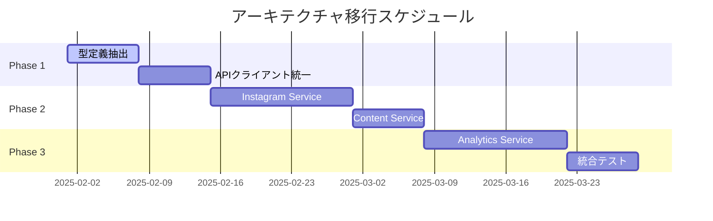

Claude Rules :look👀

# Omniy アーキテクチャ最適化提案書

## 🚀 mcp-servers 革新的再設計戦略

### 現状分析
- **課題**: mcp-servers がライブラリとマイクロサービスの中間的存在
- **影響**: テスト複雑性、依存関係の曖昧性、スケーラビリティの制約

### 提案: ハイブリッド・モジュール・アーキテクチャ

```
📁 Project Structure (Optimized)
├── 📁 packages/                    # 新設: 共有パッケージ
│   ├── 📁 shared-types/           # TypeScript型定義
│   ├── 📁 api-clients/            # Instagram/Firebase クライアント
│   └── 📁 business-logic/         # ドメインロジック
├── 📁 services/                   # 旧mcp-servers → 独立サービス化
│   ├── 📁 instagram-service/      # Instagram API専用マイクロサービス
│   ├── 📁 content-service/        # コンテンツ管理サービス
│   └── 📁 analytics-service/      # 分析・レポートサービス
├── 📁 frontend/                   # フロントエンド（既存）
└── 📁 functions/                  # Firebase Functions（既存）
```

### 実装戦略

#### Phase 1: 段階的分離（2週間）
1. **共有型定義の抽出**
```typescript
// packages/shared-types/src/instagram.ts
export interface InstagramAccount {
  id: string
  username: string
  accessToken: string
  refreshToken: string
  expiresAt: Date
  scopes: string[]
  isActive: boolean
}

// packages/shared-types/src/scheduling.ts
export interface Schedule {
  id: string
  userId: string
  accountId: string
  content: PostContent
  scheduledAt: Date
  status: ScheduleStatus
  executeCount: number
  lastExecutedAt?: Date
}
```

2. **API クライアントの統一**
```typescript
// packages/api-clients/src/instagram-client.ts
export class InstagramGraphClient {
  private readonly baseUrl = 'https://graph.instagram.com'
  
  async publishMedia(accountId: string, mediaData: MediaUpload): Promise<PublishResult> {
    // 統一されたエラーハンドリング
    // 自動リトライロジック
    // レート制限管理
    // 包括的ログ記録
  }
}
```

#### Phase 2: マイクロサービス化（3週間）
1. **Instagram Service 独立化**
```typescript
// services/instagram-service/src/server.ts
import express from 'express'
import { InstagramGraphClient } from '@omniy/api-clients'

const app = express()

app.post('/api/v1/publish', async (req, res) => {
  try {
    const result = await instagramClient.publishMedia(req.body)
    res.json({ success: true, data: result })
  } catch (error) {
    // 統一エラーレスポンス
    res.status(500).json({ 
      success: false, 
      error: error.message,
      requestId: req.id 
    })
  }
})
```

2. **サービス間通信の最適化**
```typescript
// packages/shared-types/src/service-communication.ts
export interface ServiceRequest<T = any> {
  requestId: string
  timestamp: number
  userId: string
  data: T
  metadata?: Record<string, any>
}

export interface ServiceResponse<T = any> {
  success: boolean
  data?: T
  error?: string
  requestId: string
  processingTime: number
}
```

### 期待される効果

#### 技術的改善
- **テスト容易性**: 各サービスの独立テスト可能
- **スケーラビリティ**: サービス単位での水平スケーリング
- **保守性**: 明確な責任境界、低結合・高凝集

#### ビジネス価値
- **開発速度**: 並行開発の実現
- **信頼性**: 障害の局所化、部分的ダウンタイム削減
- **コスト効率**: 必要なサービスのみスケーリング

### 移行ロードマップ



### リスク軽減策

#### 技術リスク
- **後方互換性**: 既存APIの段階的廃止予定
- **データ整合性**: 分散トランザクション管理の実装
- **ネットワーク障害**: サーキットブレーカーパターンの導入

#### 運用リスク
- **監視複雑性**: 統一ログ・メトリクス収集システム
- **デプロイ複雑性**: Dockerコンテナ化とオーケストレーション
- **データ移行**: ゼロダウンタイム移行戦略

## 💡 結論

この提案により、Omniyは次世代のスケーラブルなアーキテクチャへと進化し、エンタープライズ級の信頼性と保守性を獲得できます。