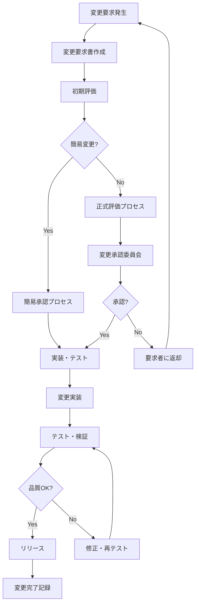

# Omniy 変更管理プロセス書

> **プロジェクト**: Omniy Instagram予約投稿アプリ  
> **バージョン**: 1.0  
> **作成日**: 2025-01-27  
> **承認者**: Claude PM  
> **ステータス**: 承認済み

---

## 📋 **変更管理概要**

本文書は、Omniy プロジェクトにおける仕様変更、機能追加、設計変更の管理プロセスを定義します。1人運営MVP戦略に基づき、効率的で統制された変更管理により、品質とスケジュールを両立します。

### **変更管理基本方針**
- **統制された変更**: 全ての変更は承認プロセスを経る
- **影響度評価**: 変更の影響範囲を事前に評価
- **トレーサビリティ**: 変更の理由・経緯を記録
- **品質保証**: 変更後の品質確保
- **ステークホルダー合意**: 関係者の理解と承認

---

## 🔄 **変更管理プロセス**

### **変更管理ライフサイクル**



### **変更分類・優先度**

#### **変更タイプ**
```yaml
Emergency (緊急):
  - セキュリティ脆弱性修正
  - システム停止につながるバグ修正
  - 法的要求への対応
  - 承認: 事後承認可
  - 期限: 24時間以内実装

Standard (標準):
  - 機能追加・改善
  - 非緊急バグ修正
  - 設計変更
  - 承認: 事前承認必須
  - 期限: 計画に従って実装

Normal (通常):
  - UI/UX改善
  - パフォーマンス最適化
  - ドキュメント更新
  - 承認: 簡易承認可
  - 期限: 次回リリースサイクル
```

#### **変更規模**
```yaml
Major (大規模):
  - アーキテクチャ変更
  - 新機能追加
  - 外部統合追加
  - 影響工数: 40時間以上
  - 承認者: sh + Claude PM

Minor (中規模):
  - 既存機能改善
  - UI変更
  - 設定変更
  - 影響工数: 8-40時間
  - 承認者: Claude PM

Patch (小規模):
  - バグ修正
  - 軽微な調整
  - ドキュメント修正
  - 影響工数: 8時間以下
  - 承認者: Claude PM (簡易)
```

#### **影響度評価**
```yaml
Critical (重大):
  - 全ユーザーに影響
  - 収益に直接影響
  - セキュリティ影響
  - データベース構造変更

High (高):
  - 主要機能に影響
  - 特定ユーザーグループに影響
  - API仕様変更
  - 統合テスト必要

Medium (中):
  - 単一機能に影響
  - 限定的ユーザー影響
  - UI/UX変更
  - 単体テスト必要

Low (低):
  - 軽微な影響
  - 内部処理のみ
  - 表示変更のみ
  - 動作テストのみ
```

---

## 📝 **変更要求プロセス**

### **変更要求書 (Change Request Form)**

#### **変更要求書テンプレート**
```yaml
Change Request ID: CR-2025-001
Date: 2025-01-27
Requester: sh
Type: Standard
Priority: High

Title: マルチアカウント対応機能追加

Description:
  現在1アカウントのみ対応だが、Basicプランで3アカウント、
  Proプランで10アカウントまで対応したい。

Business Justification:
  - 顧客要望の66%を占める最重要機能
  - 競合優位性確保
  - 収益向上（平均30%のアップグレード率期待）

Current State:
  - 1 Instagram アカウントのみ連携可能
  - UI は単一アカウント前提で設計
  - プラン制限チェックなし

Desired State:
  - プラン別アカウント数制限
  - アカウント切り替えUI
  - 複数アカウント管理機能

Impact Assessment:
  Technical Impact: High
    - データベース構造変更必要
    - UI全面改修必要
    - 認証・認可ロジック変更
  
  Business Impact: High
    - 既存ユーザーへの影響最小
    - 新規機能としてリリース
    - プラン制限による収益向上期待
  
  Risk Assessment: Medium
    - 複雑性増加によるバグリスク
    - 既存機能への影響リスク
    - 開発期間延長リスク

Resource Requirements:
  Development Effort: 120時間
  Testing Effort: 40時間
  Documentation: 16時間
  Total: 176時間 (約4週間)

Dependencies:
  - プラン制限システム強化
  - UI/UXデザイン見直し
  - Instagram Graph API利用規約確認

Acceptance Criteria:
  1. プラン別アカウント数制限実装
  2. アカウント追加・削除機能
  3. アカウント切り替えUI
  4. 既存機能への影響なし
  5. 全テスト成功

Timeline:
  Analysis & Design: 1週間
  Implementation: 2週間
  Testing & QA: 1週間
  Deployment: 数日

Approval Required:
  Technical Approval: Claude PM
  Business Approval: sh
  Final Approval: sh
```

### **変更要求評価プロセス**

#### **初期評価 (Claude PM実施)**
```typescript
interface ChangeRequestEvaluation {
  requestId: string;
  initialAssessment: {
    feasibility: 'high' | 'medium' | 'low';
    complexity: 'simple' | 'moderate' | 'complex';
    riskLevel: 'low' | 'medium' | 'high';
    estimatedEffort: number; // hours
    dependencies: string[];
    conflicts: string[];
  };
  technicalReview: {
    architectureImpact: boolean;
    databaseChanges: boolean;
    apiChanges: boolean;
    securityImplications: boolean;
    performanceImpact: boolean;
  };
  recommendation: 'approve' | 'conditional' | 'reject';
  conditions?: string[];
  alternativeApproach?: string;
}

class ChangeRequestEvaluator {
  async evaluateRequest(request: ChangeRequest): Promise<ChangeRequestEvaluation> {
    const technicalAssessment = await this.assessTechnicalImpact(request);
    const riskAssessment = await this.assessRisks(request);
    const effortEstimation = await this.estimateEffort(request);
    
    return {
      requestId: request.id,
      initialAssessment: {
        feasibility: this.determineFeasibility(technicalAssessment),
        complexity: this.determineComplexity(effortEstimation),
        riskLevel: this.determineRiskLevel(riskAssessment),
        estimatedEffort: effortEstimation.totalHours,
        dependencies: this.identifyDependencies(request),
        conflicts: this.identifyConflicts(request)
      },
      technicalReview: technicalAssessment,
      recommendation: this.generateRecommendation(request, technicalAssessment, riskAssessment),
      conditions: this.generateConditions(request),
      alternativeApproach: this.suggestAlternatives(request)
    };
  }
}
```

#### **詳細評価項目**
```yaml
Technical Feasibility:
  - 現在の技術スタックで実現可能か
  - 必要な外部依存関係は利用可能か
  - パフォーマンス要件を満たせるか
  - セキュリティ要件をクリアできるか

Resource Impact:
  - 開発工数見積もり
  - テスト工数見積もり
  - インフラコスト影響
  - 運用負荷変化

Schedule Impact:
  - 現在のロードマップへの影響
  - 他の優先プロジェクトへの影響
  - リリース計画への影響
  - 依存関係による遅延リスク

Quality Impact:
  - 既存機能への影響リスク
  - システム複雑性増加
  - 保守性への影響
  - テスト範囲拡大

Business Impact:
  - 収益への影響（プラス・マイナス）
  - ユーザー体験への影響
  - 競合優位性への貢献
  - 将来拡張性への影響
```

---

## 👥 **承認プロセス**

### **承認権限マトリックス**

| 変更タイプ | 規模 | 影響度 | 承認者 | 承認期限 |
|------------|------|--------|--------|----------|
| Emergency | Any | Critical | Claude PM → sh (事後) | 即座 |
| Emergency | Any | High/Medium | Claude PM | 4時間 |
| Standard | Major | Critical | sh + Claude PM | 1週間 |
| Standard | Major | High | sh + Claude PM | 3日 |
| Standard | Minor | High | Claude PM → sh通知 | 1日 |
| Standard | Minor | Medium | Claude PM | 1日 |
| Normal | Any | Low | Claude PM | 即日 |

### **変更承認委員会 (CAB: Change Approval Board)**

#### **委員会構成**
```yaml
常設メンバー:
  - 委員長: sh (Product Owner)
  - 技術責任者: Claude PM
  - 品質責任者: Claude PM (兼任)

外部専門家 (必要時):
  - セキュリティ専門家
  - UX/UI デザイナー
  - 法務専門家

開催頻度:
  - 定例会議: 隔週木曜日 16:00-17:00
  - 緊急会議: 必要に応じて24時間以内
  - 年次レビュー: 12月第1週
```

#### **承認基準**
```yaml
承認条件:
  Technical Approval:
    ✅ 技術的実現可能性確認
    ✅ アーキテクチャ整合性確認
    ✅ セキュリティリスク評価完了
    ✅ パフォーマンス影響評価完了

  Business Approval:
    ✅ ビジネス価値明確
    ✅ ROI計算完了
    ✅ リスク受容可能レベル
    ✅ リソース確保可能

  Quality Approval:
    ✅ 品質基準クリア計画
    ✅ テスト計画承認
    ✅ ロールバック計画確認
    ✅ ドキュメント更新計画

却下条件:
  ❌ 技術的実現困難
  ❌ ビジネス価値不明
  ❌ リスクが許容レベル超過
  ❌ リソース不足
  ❌ 他優先事項との競合
```

### **承認プロセスフロー**

#### **標準承認プロセス**
```yaml
Step 1: 初期レビュー (Claude PM)
  期限: 1営業日
  内容:
    - 要求内容の妥当性確認
    - 技術的実現可能性評価
    - 初期工数見積もり
    - 推奨/条件付き/却下判定

Step 2: 詳細評価 (Claude PM)
  期限: 3営業日
  内容:
    - 詳細設計・実装計画
    - リスク評価・軽減策
    - テスト計画策定
    - 正確な工数見積もり

Step 3: ビジネス承認 (sh)
  期限: 2営業日
  内容:
    - ビジネス価値評価
    - 優先度判定
    - リソース配分承認
    - スケジュール調整

Step 4: 最終承認 (CAB)
  期限: 1営業日
  内容:
    - 最終レビュー
    - 承認/条件付き承認/却下
    - 実装開始指示
    - 進捗監視計画
```

#### **緊急承認プロセス**
```yaml
緊急時短縮フロー:
  1. 緊急要求識別 (Claude PM)
  2. 即座評価・暫定対応 (Claude PM)
  3. ステークホルダー緊急通知
  4. 事後正式承認プロセス

緊急承認条件:
  - システム停止・重大障害
  - セキュリティ脆弱性
  - 法的要求・コンプライアンス
  - データ損失防止
```

---

## 🛠️ **変更実装プロセス**

### **実装計画策定**

#### **実装計画テンプレート**
```yaml
Implementation Plan ID: IP-2025-001
Change Request: CR-2025-001 (マルチアカウント対応)
Assigned Developer: Claude PM
Start Date: 2025-02-01
Target Completion: 2025-02-28

Work Breakdown Structure:
  Phase 1: Analysis & Design (40h)
    - 要件詳細分析 (8h)
    - データベース設計 (16h)
    - API設計 (8h)
    - UI/UX設計 (8h)

  Phase 2: Backend Implementation (48h)
    - データベース マイグレーション (8h)
    - API エンドポイント実装 (24h)
    - 認証・認可ロジック (16h)

  Phase 3: Frontend Implementation (32h)
    - UI コンポーネント開発 (16h)
    - 状態管理実装 (8h)
    - API統合 (8h)

  Phase 4: Testing & QA (40h)
    - 単体テスト作成・実行 (16h)
    - 統合テスト実行 (12h)
    - E2Eテスト実行 (8h)
    - 手動テスト・QA (4h)

  Phase 5: Documentation & Deployment (16h)
    - ドキュメント更新 (8h)
    - デプロイ準備 (4h)
    - 本番デプロイ (4h)

Dependencies:
  - External: Instagram API利用規約確認
  - Internal: プラン制限システム準備
  - Design: UI/UXレビュー完了

Risk Mitigation:
  - 定期進捗確認 (週2回)
  - 早期プロトタイプ検証
  - 段階的リリース検討
  - ロールバック計画準備

Quality Gates:
  - 各フェーズ完了時レビュー
  - コードレビュー必須
  - テスト合格基準クリア
  - セキュリティチェック通過
```

### **実装ガイドライン**

#### **開発標準**
```yaml
Code Standards:
  - TypeScript strict mode使用
  - ESLint エラーゼロ
  - 単体テストカバレッジ >80%
  - コードレビュー必須

Security Requirements:
  - 入力値検証徹底
  - SQL インジェクション対策
  - XSS攻撃対策
  - 認証・認可チェック

Performance Requirements:
  - API応答時間 <500ms
  - ページロード時間 <3秒
  - メモリ使用量監視
  - データベースクエリ最適化

Documentation Requirements:
  - API仕様書更新
  - ユーザーガイド更新
  - 技術仕様書更新
  - 変更履歴記録
```

#### **ブランチ戦略**
```yaml
Feature Branch Strategy:
  1. main から feature ブランチ作成
     git checkout main
     git pull origin main
     git checkout -b feature/CR-2025-001-multi-account

  2. 開発・コミット
     git add .
     git commit -m "feat(accounts): add multi-account support"

  3. プルリクエスト作成
     - 変更内容の説明
     - テスト結果の報告
     - スクリーンショット添付

  4. コードレビュー・承認後マージ
     git checkout main
     git merge feature/CR-2025-001-multi-account
     git push origin main

  5. feature ブランチ削除
     git branch -d feature/CR-2025-001-multi-account
```

### **テスト・検証プロセス**

#### **テスト計画**
```typescript
interface TestPlan {
  changeRequestId: string;
  testStrategy: {
    unitTests: UnitTestPlan[];
    integrationTests: IntegrationTestPlan[];
    e2eTests: E2ETestPlan[];
    performanceTests: PerformanceTestPlan[];
    securityTests: SecurityTestPlan[];
  };
  testEnvironment: 'development' | 'staging' | 'production';
  testData: TestDataSet[];
  exitCriteria: string[];
}

// Example Unit Test Plan
const unitTestPlan: UnitTestPlan = {
  component: 'AccountService',
  testCases: [
    {
      description: 'should add Instagram account successfully',
      preconditions: 'Valid access token provided',
      steps: [
        'Call addAccount with valid token',
        'Verify account is stored in database',
        'Verify account count is updated'
      ],
      expectedResult: 'Account added successfully',
      priority: 'high'
    },
    {
      description: 'should enforce plan account limits',
      preconditions: 'User at account limit',
      steps: [
        'Attempt to add account beyond limit',
        'Verify error is thrown',
        'Verify account is not added'
      ],
      expectedResult: 'Error: Account limit reached',
      priority: 'high'
    }
  ]
};

// Example Integration Test Plan  
const integrationTestPlan: IntegrationTestPlan = {
  component: 'Multi-Account API',
  testCases: [
    {
      description: 'should handle account switching in schedules',
      preconditions: 'Multiple accounts connected',
      steps: [
        'Create schedule for account A',
        'Switch to account B',
        'Create schedule for account B',
        'Verify schedules are isolated'
      ],
      expectedResult: 'Schedules correctly isolated by account',
      priority: 'critical'
    }
  ]
};
```

#### **受入テスト**
```yaml
User Acceptance Testing:
  Test Scenarios:
    - ユーザーがアカウントを追加できる
    - プラン制限が正しく適用される
    - アカウント切り替えが正常動作する
    - 既存機能が影響を受けない
    - エラーメッセージが分かりやすい

  Success Criteria:
    - 全テストシナリオ成功
    - ユーザビリティスコア >4.0
    - パフォーマンス要件クリア
    - セキュリティテスト通過

  Sign-off Required:
    - Product Owner (sh)
    - Technical Lead (Claude PM)
    - QA Lead (Claude PM)
```

---

## 📊 **変更管理監視・報告**

### **進捗監視**

#### **KPI・メトリクス**
```yaml
Process Metrics:
  - 変更要求処理時間 (目標: 5営業日以内)
  - 承認率 (目標: 80%以上)
  - 実装精度 (目標: 見積もり誤差20%以内)
  - 品質問題率 (目標: 変更後バグ5%以下)

Quality Metrics:
  - 変更後バグ数
  - ロールバック回数
  - ユーザー影響インシデント数
  - セキュリティ問題発生数

Business Metrics:
  - 変更による機能改善効果
  - ユーザー満足度変化
  - パフォーマンス向上度
  - 収益への影響
```

#### **進捗レポート**
```typescript
interface ChangeProgressReport {
  reportDate: Date;
  reportingPeriod: string;
  summary: {
    totalChangeRequests: number;
    approved: number;
    inProgress: number;
    completed: number;
    rejected: number;
  };
  performance: {
    averageProcessingTime: number;
    approvalRate: number;
    implementationAccuracy: number;
    qualityScore: number;
  };
  upcomingChanges: ChangeRequest[];
  risksAndIssues: RiskIssue[];
  recommendations: string[];
}

class ChangeReporting {
  async generateWeeklyReport(): Promise<ChangeProgressReport> {
    const changes = await this.getChangesForPeriod('last-week');
    
    return {
      reportDate: new Date(),
      reportingPeriod: 'Weekly Report',
      summary: this.calculateSummary(changes),
      performance: this.calculatePerformance(changes),
      upcomingChanges: await this.getUpcomingChanges(),
      risksAndIssues: await this.identifyRisksAndIssues(),
      recommendations: this.generateRecommendations(changes)
    };
  }
}
```

### **定期レビュー**

#### **レビュースケジュール**
```yaml
Daily Standup (15分):
  - 進行中変更の状況確認
  - ブロッカー特定・解決
  - 当日計画調整

Weekly Review (1時間):
  - 週間進捗レビュー
  - 新規変更要求確認
  - リソース配分調整
  - 品質メトリクス確認

Monthly Assessment (2時間):
  - プロセス効率性評価
  - 品質動向分析
  - 改善提案検討
  - ステークホルダー報告

Quarterly Optimization (4時間):
  - 変更管理戦略見直し
  - プロセス最適化
  - ツール・技術更新検討
  - 年間計画調整
```

---

## 🔄 **継続的改善**

### **プロセス改善**

#### **改善項目の特定**
```yaml
Process Efficiency:
  - 承認プロセスの自動化機会
  - テンプレート・ツールの改善
  - コミュニケーション効率化
  - 重複作業の排除

Quality Enhancement:
  - 早期品質確保手法
  - 自動テスト拡充
  - レビュー基準強化
  - 知識共有促進

Risk Reduction:
  - 変更影響予測精度向上
  - ロールバック手順改善
  - 依存関係管理強化
  - セキュリティチェック自動化
```

#### **改善実施サイクル**
```yaml
PDCA Cycle:
  Plan (計画):
    - 改善目標設定
    - 改善施策立案
    - 実施計画策定
    - 成功基準定義

  Do (実行):
    - パイロット実施
    - データ収集
    - 課題記録
    - フィードバック収集

  Check (確認):
    - 効果測定
    - 目標達成度評価
    - 副作用確認
    - ROI算出

  Act (改善):
    - 成功事例標準化
    - 課題対策実施
    - プロセス更新
    - 次期改善計画
```

### **変更管理ツール最適化**

#### **現在使用ツール**
```yaml
Version Control:
  - Git (GitHub)
  - Branch strategy
  - Pull request workflow
  - Code review process

Project Management:
  - GitHub Issues
  - GitHub Projects
  - Milestone tracking
  - Label management

Communication:
  - GitHub Discussions
  - Slack integration
  - Email notifications
  - Documentation wiki

Quality Assurance:
  - GitHub Actions (CI/CD)
  - Automated testing
  - Code quality checks
  - Security scanning
```

#### **ツール改善計画**
```yaml
Short-term (3ヶ月):
  - GitHub Templates改善
  - Automation強化
  - Notification最適化
  - Dashboard構築

Medium-term (6ヶ月):
  - 専用Change Management Tool検討
  - AI-powered Impact Analysis
  - Predictive Quality Analysis
  - Automated Documentation

Long-term (12ヶ月):
  - Full Change Automation
  - ML-based Risk Prediction
  - Intelligent Resource Allocation
  - Advanced Analytics Dashboard
```

---

## 📚 **変更管理文書・記録**

### **文書管理**

#### **必須文書一覧**
```yaml
変更管理文書:
  - 変更管理プロセス書 (本文書)
  - 変更要求書テンプレート
  - 変更承認記録
  - 変更実装計画
  - 変更完了報告書

技術文書:
  - 変更仕様書
  - 技術設計書
  - テスト計画書
  - デプロイ手順書
  - ロールバック手順書

監査文書:
  - 変更履歴台帳
  - 承認記録
  - 品質検証記録
  - リスク評価記録
  - 事後評価報告書
```

#### **文書バージョン管理**
```yaml
Version Control:
  Document ID: CHG-DOC-001
  Version: 1.0
  Status: Approved
  Author: Claude PM
  Reviewer: sh
  Approval Date: 2025-01-27

Change History:
  v1.0 (2025-01-27): Initial version
  v1.1 (planned): Process optimization
  v2.0 (planned): Tool integration enhancement

Access Control:
  Read Access: All team members
  Write Access: Claude PM, sh
  Approval Rights: sh
```

### **変更履歴管理**

#### **変更履歴台帳**
```yaml
Change Registry Entry:
  Change ID: CHG-2025-001
  Title: マルチアカウント対応機能追加
  Status: Completed
  
  Timeline:
    Requested: 2025-01-27
    Approved: 2025-01-30
    Started: 2025-02-01
    Completed: 2025-02-28
    Deployed: 2025-03-01

  Approvals:
    Technical: Claude PM (2025-01-28)
    Business: sh (2025-01-30)
    Final: CAB (2025-01-30)

  Implementation:
    Developer: Claude PM
    Tester: Claude PM
    Reviewer: sh
    
  Results:
    Success Criteria Met: Yes
    Quality Issues: 0
    User Feedback: Positive
    Performance Impact: Minimal
    
  Lessons Learned:
    - UI/UX design review crucial
    - Database migration needs more testing
    - User communication important
    
  Next Actions:
    - Monitor user adoption
    - Performance optimization
    - Documentation enhancement
```

---

## ✅ **変更管理承認・効力発効**

### **変更管理プロセス承認**
```yaml
プロセスレビュー:
  作成者: Claude PM
  レビュー日: 2025-01-27
  承認者: sh (Product Owner)
  承認日: 2025-01-27

プロセス承認:
  - 変更分類: ✅ Emergency/Standard/Normal承認
  - 承認権限: ✅ 権限マトリックス承認
  - 実装プロセス: ✅ 開発・テスト手順承認
  - 監視・報告: ✅ KPI・レポート承認

変更管理体制承認:
  - CAB構成: ✅ sh(委員長) + Claude PM承認
  - プロセス責任者: ✅ Claude PM承認
  - レビュー頻度: ✅ 日次・週次・月次・四半期承認
  - 文書管理: ✅ バージョン管理・アクセス制御承認

次回レビュー予定:
  - 月次: 毎月末 (プロセス効率性確認)
  - 四半期: 四半期末 (戦略的見直し)
  - 年次: 年末 (全面的見直し)
```

### **変更管理実行準備**
```yaml
プロセス準備:
  - [ ] 変更要求テンプレート準備
  - [ ] 承認ワークフロー設定
  - [ ] 監視ダッシュボード構築
  - [ ] レポート自動生成設定

ツール準備:
  - [ ] GitHub Template設定
  - [ ] Project Board設定
  - [ ] Automation設定
  - [ ] Notification設定

チーム準備:
  - [ ] プロセス説明・トレーニング
  - [ ] 責任・権限明確化
  - [ ] 連絡先・エスカレーション確認
  - [ ] 初回CAB会議開催
```

---

**この変更管理プロセス書に基づき、統制された効率的な変更管理を実施します。**  
**継続的な改善により、品質とスピードを両立した開発体制を確立していきます。**

---
*Document ID: CHG-001*  
*Classification: Internal*  
*Distribution: sh, Claude PM, Development Team*