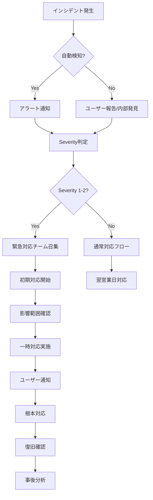

# Omniy 障害対応手順書

最終更新日: 2025年1月27日

## 🎯 目的

本文書は、Omniy Instagram自動投稿サービスで発生する障害・インシデントに対する標準的な対応手順を定義し、迅速かつ効果的な復旧を図ることを目的とします。

## 📋 インシデント分類

### Severity 1 (Critical) - 緊急
- **定義**: サービス全停止、セキュリティ侵害、データ損失
- **対応時間**: 15分以内に対応開始
- **復旧目標**: 1時間以内
- **例**: 
  - 全ユーザーがログインできない
  - データベース完全停止
  - セキュリティ侵害の検知

### Severity 2 (High) - 高
- **定義**: 主要機能の障害、大量のユーザーに影響
- **対応時間**: 30分以内に対応開始
- **復旧目標**: 4時間以内
- **例**:
  - Instagram投稿機能が全く動作しない
  - 決済処理エラー
  - Cloud Functions大規模障害

### Severity 3 (Medium) - 中
- **定義**: 一部機能の障害、限定的なユーザーへの影響
- **対応時間**: 2時間以内に対応開始
- **復旧目標**: 8時間以内
- **例**:
  - 特定アカウントの投稿失敗
  - UI表示の不具合
  - 通知メール遅延

### Severity 4 (Low) - 低
- **定義**: 軽微な不具合、回避策が存在
- **対応時間**: 翌営業日に対応開始
- **復旧目標**: 72時間以内
- **例**:
  - ダッシュボード表示の軽微な崩れ
  - 非重要なログエラー

---

## 🚨 緊急対応フロー (Severity 1-2)

### 対応フローチャート



### Step 1: 初期対応（0-15分）

#### 1.1 インシデント検知
- **自動監視**: Google Cloud Monitoring アラート
- **ユーザー報告**: サポートメール (support@omniy.jp)
- **内部発見**: 開発チーム・運用チーム

#### 1.2 緊急連絡
```bash
# 緊急時連絡先（Severity 1の場合）
- システム管理者: [phone] [email]
- 開発責任者: [phone] [email]
- 経営陣: [phone] [email]
```

#### 1.3 インシデント管理システム
- **GitHub Issues**: 緊急インシデント用ラベル "incident:critical"
- **Slack**: #incident-response チャンネル
- **Google Sheets**: インシデント記録スプレッドシート

### Step 2: 状況確認（15-30分）

#### 2.1 影響範囲確認
```bash
# システム状況確認コマンド
firebase emulators:start # ローカル環境でテスト
gcloud compute instances list --project=omniy-prod
gcloud functions list --project=omniy-prod
```

#### 2.2 ログ確認
```bash
# Cloud Functions ログ
gcloud functions logs read --project=omniy-prod
# Firestore 監査ログ
gcloud logging read "resource.type=gce_instance" --project=omniy-prod
# エラー率統計
gcloud monitoring metrics list --project=omniy-prod
```

#### 2.3 外部サービス状況
- **Firebase Status**: https://status.firebase.google.com/
- **Instagram Graph API**: https://developers.facebook.com/status/
- **Stripe Status**: https://status.stripe.com/

### Step 3: 初期対応（30-60分）

#### 3.1 一時復旧措置
```bash
# サービス再起動
gcloud functions deploy postExecutor --project=omniy-prod
# ロードバランサー設定変更
gcloud compute backend-services update --project=omniy-prod
# キャッシュクリア
gcloud compute url-maps invalidate-cdn-cache --project=omniy-prod
```

#### 3.2 回避策実装
- **機能の一時無効化**: 障害機能のフィーチャーフラグOFF
- **代替手段提示**: ユーザーへの手動投稿案内
- **負荷軽減**: レート制限の一時強化

### Step 4: ユーザー通知（60分以内）

#### 4.1 ステータスページ更新
```markdown
# 障害通知テンプレート
**[障害報告] Instagram投稿機能に関する障害について**

発生時刻: 2025-01-27 14:30 JST
影響範囲: 全ユーザーのInstagram自動投稿機能
現在の状況: 調査中
予想復旧時刻: 16:00 JST（予定）

お客様にはご迷惑をおかけし、深くお詫び申し上げます。
復旧次第、改めてご報告いたします。
```

#### 4.2 通知方法
- **Webサイト**: トップページバナー
- **メール**: 影響ユーザーへの一斉送信
- **SNS**: Twitter @OmniyApp での状況報告

---

## 🔧 具体的な障害対応手順

### ケース1: Cloud Functions 障害

#### 症状
- HTTP 500エラー多発
- 投稿実行の完全停止
- ダッシュボード API エラー

#### 対応手順
```bash
# 1. ログ確認
gcloud functions logs read postExecutor --limit=50

# 2. 関数の状態確認
gcloud functions describe postExecutor

# 3. 再デプロイ実行
cd functions
npm run build
firebase deploy --only functions:postExecutor

# 4. 動作確認
curl -X POST https://us-central1-omniy-prod.cloudfunctions.net/postExecutor
```

#### 根本原因調査
- デプロイメント履歴の確認
- 依存ライブラリ変更の影響
- メモリ・タイムアウト設定の見直し

### ケース2: Firestore 接続障害

#### 症状
- データ読み込みエラー
- 認証失敗
- 投稿履歴が表示されない

#### 対応手順
```bash
# 1. Firestore接続テスト
firebase emulators:start --only firestore

# 2. セキュリティルール確認
firebase firestore:rules:get

# 3. インデックス状況確認
firebase firestore:indexes

# 4. 接続設定修復
firebase use omniy-prod
firebase deploy --only firestore:rules
```

#### データ整合性確認
```javascript
// Firestore データ整合性チェックスクリプト
const admin = require('firebase-admin');
admin.initializeApp();
const db = admin.firestore();

async function checkDataIntegrity() {
  const users = await db.collection('users').get();
  const schedules = await db.collection('schedules').get();
  
  console.log(`Users: ${users.size}, Schedules: ${schedules.size}`);
  
  // 孤立したスケジュールをチェック
  for (const schedule of schedules.docs) {
    const userId = schedule.data().userId;
    const userExists = await db.collection('users').doc(userId).get();
    if (!userExists.exists) {
      console.log(`Orphaned schedule: ${schedule.id}`);
    }
  }
}
```

### ケース3: Instagram Graph API 障害

#### 症状
- 投稿がすべて失敗
- "Invalid access token" エラー
- API レート制限エラー

#### 対応手順
```bash
# 1. Instagram API 状況確認
curl -X GET "https://graph.instagram.com/me?access_token=ACCESS_TOKEN"

# 2. アクセストークン更新
# functions/src/api/igAccounts.ts の refreshInstagramToken 実行

# 3. API制限状況確認
# Graph API Explorer で現在のレート制限を確認

# 4. 投稿キューの一時停止
# postExecutor.ts で実行を一時停止
```

#### 代替対応
- 手動投稿の案内メール送信
- 投稿予定の延期オプション提供
- API復旧後の自動リトライ設定

### ケース4: Stripe決済障害

#### 症状
- 決済処理の失敗
- サブスクリプション更新エラー
- Webhook 受信失敗

#### 対応手順
```bash
# 1. Stripe ダッシュボード確認
# https://dashboard.stripe.com/

# 2. Webhook エンドポイント確認
curl -X POST https://us-central1-omniy-prod.cloudfunctions.net/stripeWebhook

# 3. 失敗した決済の手動処理
# Stripe CLI での決済状況確認
stripe charges list --limit=10

# 4. サブスクリプション状態修復
# functions/src/api/stripe.ts での手動同期実行
```

---

## 📊 復旧後の対応

### 各重要度レベルの対応例

#### Severity 1 (Critical) 対応例

**シナリオ**: 全ユーザーがログインできない
```yaml
検知時刻: 14:30
初期対応: 14:35 (5分)
  - Firebase Auth状態確認
  - Google Cloud Console確認
  - 緊急連絡実施

影響確認: 14:40 (10分)
  - 影響ユーザー数: 全ユーザー (500名)
  - ビジネス影響: 売上停止、信頼失墜リスク

一時対応: 14:50 (20分)
  - Firebase Auth設定リセット
  - 代替認証方法の検討
  - ユーザー通知準備

復旧作業: 15:00 (30分)
  - 設定修正と再デプロイ
  - 段階的復旧確認
  - モニタリング強化

完全復旧: 15:30 (60分)
  - 全機能復旧確認
  - ユーザー通知完了
  - 事後分析開始
```

#### Severity 2 (High) 対応例

**シナリオ**: Instagram投稿機能が全く動作しない
```yaml
検知時刻: 10:00
初期対応: 10:20 (20分)
  - Cloud Functions ログ確認
  - Instagram API状態確認
  - 開発チーム召集

影響確認: 10:40 (40分)
  - 影響機能: 自動投稿、手動投稿
  - 影響ユーザー: 有料プラン全員 (100名)

一時対応: 11:00 (60分)
  - 手動投稿案内メール送信
  - API接続再試行
  - 投稿キュー一時停止

復旧作業: 12:00 (120分)
  - アクセストークン更新
  - 関数再デプロイ
  - 段階的機能復旧

完全復旧: 14:00 (240分)
  - 投稿機能復旧
  - 保留投稿の再実行
  - お詫びメール送信
```

#### Severity 3 (Medium) 対応例

**シナリオ**: 特定アカウントの投稿失敗
```yaml
検知時刻: 09:00
初期対応: 11:00 (2時間)
  - 該当アカウント特定
  - エラーログ収集
  - 影響範囲確認

調査実施: 13:00 (4時間)
  - アカウント設定確認
  - トークン有効性確認
  - API制限確認

修正対応: 15:00 (6時間)
  - アカウント再認証
  - 設定修正
  - 動作確認

完了報告: 17:00 (8時間)
  - ユーザー個別連絡
  - 補償対応（必要時）
  - ナレッジ更新
```

### 連絡先とEscalation手順

#### 内部連絡体制
```yaml
Level 1 - 開発チーム:
  - 対応時間: 平日 9:00-18:00
  - 連絡方法: Slack #dev-team
  - 対応範囲: 技術的問題全般

Level 2 - システム管理者:
  - 対応時間: 24時間 (オンコール)
  - 連絡方法: 
    - 優先: 携帯電話 080-XXXX-XXXX
    - 予備: emergency@omniy.jp
  - 対応範囲: インフラ障害、セキュリティ

Level 3 - 経営陣:
  - 対応時間: 24時間 (Severity 1のみ)
  - 連絡方法: 
    - sh: 090-XXXX-XXXX
    - 緊急会議: Google Meet (URL固定)
  - 対応範囲: 事業継続性判断

外部連絡先:
  - Firebase Support: 
    - Email: firebase-support@google.com
    - Priority: P1チケット作成
  - Stripe Support:
    - Dashboard: https://dashboard.stripe.com/support
    - 緊急: +1-888-889-xxxx
  - Instagram/Meta:
    - Developer Support: https://developers.facebook.com/support/
```

#### Escalation基準
```yaml
自動Escalation条件:
  - 対応開始遅延: SLA時間の50%経過
  - 復旧遅延: 目標時間超過
  - 影響拡大: 当初想定の2倍以上
  - 追加障害: 関連システムへの波及

判断基準:
  - データ損失リスク → 即座にLevel 3
  - セキュリティ侵害 → 即座にLevel 3
  - 売上影響 > ¥100,000 → Level 2
  - メディア露出リスク → Level 3
```

### Step 1: 根本原因分析（RCA）

#### 分析項目
- **発生原因**: 技術的要因、人的要因、外部要因
- **検知時間**: アラートから対応開始まで
- **復旧時間**: 対応開始から完全復旧まで
- **影響範囲**: 影響ユーザー数、データ損失有無

#### RCAレポート作成
```markdown
# インシデントレポート（INC-2025-001）

## 概要
- インシデント ID: INC-2025-001
- 発生日時: 2025-01-27 14:30:00 JST
- 復旧日時: 2025-01-27 16:15:00 JST
- 影響時間: 1時間45分
- Severity: 2 (High)

## 発生状況
[詳細な状況説明]

## 根本原因
[技術的な原因分析]

## 対応内容
[実施した対応手順]

## 再発防止策
[具体的な改善施策]
```

### Step 2: 事後改善

#### 技術的改善
- **監視強化**: 新たなメトリクス追加
- **冗長化**: SPOF (Single Point of Failure) の解消
- **自動化**: 手動作業の自動化
- **テスト強化**: 障害シナリオのテスト追加

#### プロセス改善
- **検知時間短縮**: アラート設定の見直し
- **対応時間短縮**: 対応手順の効率化
- **コミュニケーション**: 通知方法の改善
- **ナレッジ共有**: 対応手順の文書化

---

## 🔍 監視・アラート設定

### Google Cloud Monitoring

#### Cloud Functions 監視
```yaml
# functions-error-rate.yaml
displayName: "Cloud Functions Error Rate"
conditions:
  - displayName: "Error rate > 5%"
    conditionThreshold:
      filter: 'resource.type="cloud_function"'
      comparison: COMPARISON_GREATER_THAN
      thresholdValue: 0.05
      duration: 300s
```

#### Firestore 監視
```yaml
# firestore-latency.yaml
displayName: "Firestore Query Latency"
conditions:
  - displayName: "P95 latency > 1000ms"
    conditionThreshold:
      filter: 'resource.type="datastore_database"'
      comparison: COMPARISON_GREATER_THAN
      thresholdValue: 1000
```

### アプリケーション監視

#### カスタムメトリクス
```javascript
// functions/src/utils/monitoring.ts
import { Monitoring } from '@google-cloud/monitoring';

const monitoring = new Monitoring.MetricServiceClient();

export async function recordPostExecutionMetric(success: boolean) {
  const request = {
    name: `projects/omniy-prod/metricDescriptors/custom.googleapis.com/post_execution`,
    metricDescriptor: {
      labels: [{ key: 'status', valueType: 'STRING' }],
      metricKind: 'GAUGE',
      valueType: 'INT64'
    }
  };
  
  await monitoring.createTimeSeries({
    name: `projects/omniy-prod`,
    timeSeries: [{
      metric: { type: 'custom.googleapis.com/post_execution' },
      resource: { type: 'global' },
      points: [{
        interval: { endTime: { seconds: Date.now() / 1000 } },
        value: { int64Value: success ? 1 : 0 }
      }]
    }]
  });
}
```

---

## 📞 エスカレーション

### レベル1: 開発チーム
- **対応時間**: 平日 9:00-18:00
- **対応内容**: 一般的な技術的問題
- **連絡先**: tech@omniy.jp

### レベル2: システム管理者
- **対応時間**: 24時間（オンコール）
- **対応内容**: インフラ障害、セキュリティ問題
- **連絡先**: [緊急連絡先]

### レベル3: 経営陣
- **対応時間**: 24時間（緊急時のみ）
- **対応内容**: 事業継続性に影響する重大障害
- **連絡先**: [経営陣緊急連絡先]

---

## 📚 関連ドキュメント

- [技術仕様書](./TECHNICAL_SPECIFICATIONS.md)
- [運用手順書](./OPERATIONS.md)
- [セキュリティ対応手順](./SECURITY_INCIDENT_RESPONSE.md)
- [バックアップ・リストア手順](./BACKUP_RESTORE.md)

---

**作成者**: システム管理者  
**承認者**: CTOあ  
**次回見直し**: 2025年4月27日