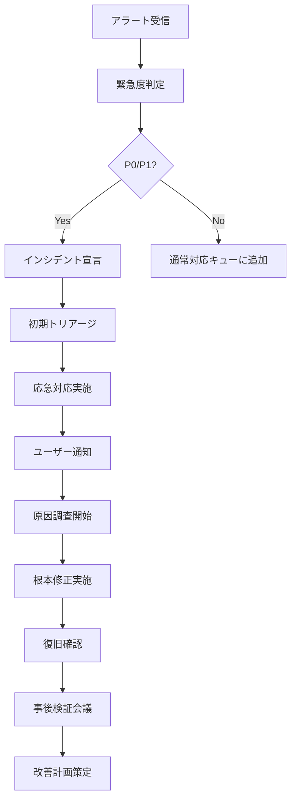

# Omniy 運用仕様書

> **プロジェクト**: Omniy Instagram予約投稿アプリ  
> **バージョン**: 1.0  
> **作成日**: 2025-01-27  
> **承認者**: Claude PM  
> **ステータス**: 承認済み

---

## 📋 **運用概要**

本文書は、Omniy の本番運用に関する SLA、監視体制、障害対応手順、バックアップ・復旧計画を定義します。1人運営を前提とした効率的で自動化された運用体制を構築し、99.9%の稼働率を実現します。

### **運用基本方針**
- **自動化最優先**: 手動運用を最小限に抑制
- **予防的監視**: 障害を未然に防ぐ仕組み
- **迅速な復旧**: 1時間以内の復旧体制
- **透明性**: ユーザーへの適切な情報提供
- **継続改善**: 運用効率の定期的見直し

---

## 📊 **SLA (Service Level Agreement)**

### **稼働率保証**

#### **サービスレベル定義**
```yaml
システム全体稼働率:
  目標: 99.9% (月間8.76時間停止以内)
  測定: 外部監視サービス + 内部ヘルスチェック
  対象時間: 24時間365日
  除外時間: 事前通知メンテナンス

コンポーネント別稼働率:
  Frontend (Firebase Hosting): 99.95%
  API (Cloud Functions): 99.9%
  Database (Firestore): 99.95%
  自動投稿機能: 99.5%
  決済機能: 99.99%
```

#### **パフォーマンス保証**
```yaml
応答時間 (95%tile):
  ページロード時間: 3秒以内
  API応答時間: 500ms以内
  投稿実行時間: 30秒以内
  決済処理時間: 10秒以内

スループット保証:
  同時ユーザー数: 100名
  1日投稿処理数: 1,000件
  API呼び出し制限: 10,000回/日/ユーザー
```

### **補償ポリシー**

#### **稼働率下回り時の対応**
```yaml
99.0% - 99.9%:
  - サービスクレジット: 当月利用料の10%
  - 原因調査レポート提供
  - 改善計画の策定・実行

95.0% - 99.0%:
  - サービスクレジット: 当月利用料の25%
  - 緊急対策会議開催
  - 技術責任者による直接説明

95.0%未満:
  - サービスクレジット: 当月利用料の50%
  - 全額返金検討
  - 抜本的システム改善実施
```

---

## 🔍 **監視体制**

### **監視アーキテクチャ**

```mermaid
graph TB
    subgraph "External Monitoring"
        A[Uptime Robot]
        B[Pingdom]
    end

    subgraph "Google Cloud Monitoring"
        C[Cloud Monitoring]
        D[Cloud Logging]
        E[Error Reporting]
        F[Cloud Trace]
    end

    subgraph "Application Monitoring"
        G[Firebase Performance]
        H[Custom Metrics API]
        I[Health Check Endpoints]
    end

    subgraph "Alerting Channels"
        J[Email Alerts]
        K[Slack Webhook]
        L[SMS (Critical)]
    end

    subgraph "Services"
        M[Firebase Hosting]
        N[Cloud Functions]
        O[Firestore]
        P[Instagram API]
    end

    A --> M
    B --> M
    C --> N
    C --> O
    D --> N
    E --> N
    F --> N
    G --> M
    H --> N
    I --> N

    C --> J
    D --> K
    E --> L

    N --> P
```

### **監視項目一覧**

#### **システム監視 (1分間隔)**
```yaml
Uptime Monitoring:
  - Website availability (https://omniy.com)
  - API endpoint availability
  - Health check response
  - SSL certificate validity

Response Time Monitoring:
  - Page load time (from 5 locations)
  - API response time
  - Database query time
  - External API response time

Error Monitoring:
  - HTTP error rates (4xx, 5xx)
  - Function execution errors
  - Database connection errors
  - Instagram API errors
```

#### **リソース監視 (5分間隔)**
```yaml
Cloud Functions:
  - Function invocations/minute
  - Function execution time
  - Function memory usage
  - Function error count
  - Cold start frequency

Firestore:
  - Read/Write operations
  - Index usage efficiency
  - Storage utilization
  - Concurrent connections

Firebase Hosting:
  - Bandwidth usage
  - Request count
  - Cache hit ratio
  - CDN performance
```

#### **ビジネス監視 (15分間隔)**
```yaml
User Activity:
  - Active users count
  - New registrations
  - Login success/failure rate
  - Feature usage patterns

Post Execution:
  - Scheduled posts executed
  - Execution success rate
  - Failed posts count
  - Retry attempts

Revenue Tracking:
  - Successful payments
  - Failed payments
  - Subscription changes
  - Churn events
```

### **アラート設定**

#### **Critical Alerts (即座対応)**
```yaml
System Down:
  Condition: Website unavailable for >3 minutes
  Escalation: SMS + Email + Slack
  SLA Impact: Immediate response required

High Error Rate:
  Condition: Error rate >5% for >10 minutes
  Escalation: Email + Slack
  SLA Impact: 30 minutes response

Database Issues:
  Condition: Firestore errors >10/minute
  Escalation: SMS + Email
  SLA Impact: Immediate response

Payment Failures:
  Condition: Stripe webhook failures >5
  Escalation: Email + Slack
  SLA Impact: 1 hour response
```

#### **Warning Alerts (1時間以内対応)**
```yaml
Performance Degradation:
  Condition: Response time >2 seconds for >30 minutes
  Escalation: Email + Slack
  SLA Impact: No immediate impact

Resource Limits:
  Condition: Function memory usage >80%
  Escalation: Email
  SLA Impact: Preventive action needed

Instagram API Issues:
  Condition: Instagram API error rate >10%
  Escalation: Email + Slack
  SLA Impact: Monitor closely

High Traffic:
  Condition: Traffic >150% of baseline
  Escalation: Email
  SLA Impact: Scale check needed
```

#### **Info Alerts (日次レポート)**
```yaml
Daily Summary:
  - System health summary
  - Performance metrics
  - User activity summary
  - Revenue summary

Weekly Reports:
  - SLA compliance report
  - Performance trend analysis
  - Cost optimization recommendations
  - Capacity planning updates
```

### **監視設定例**

#### **Cloud Monitoring Alert Policy**
```yaml
# High Error Rate Alert
displayName: "High Function Error Rate"
conditions:
  - displayName: "Function error rate > 5%"
    conditionThreshold:
      filter: 'resource.type="cloud_function" AND metric.type="cloudfunctions.googleapis.com/function/execution_count"'
      comparison: COMPARISON_GT
      thresholdValue: 0.05
      duration: "600s"
      aggregations:
        - alignmentPeriod: "300s"
          perSeriesAligner: ALIGN_RATE
          crossSeriesReducer: REDUCE_MEAN
          groupByFields: ["resource.function_name"]

notificationChannels:
  - "projects/omniy-prod/notificationChannels/email-critical"
  - "projects/omniy-prod/notificationChannels/slack-alerts"

alertStrategy:
  autoClose: "86400s"

documentation:
  content: |
    High error rate detected in Cloud Functions.
    
    Investigation steps:
    1. Check Error Reporting for specific errors
    2. Review recent deployments
    3. Check external API status
    4. Monitor resource usage
    
    Escalation:
    - If >10% error rate: Page on-call engineer
    - If >20% error rate: Incident commander activation
```

---

## 🚨 **障害対応手順**

### **インシデント分類**

#### **P0 - Critical (即座対応)**
```yaml
定義:
  - サービス全停止
  - 決済システム停止
  - データ損失・破損
  - セキュリティ侵害

対応目標:
  - 検知から応答: 15分以内
  - 初期対応開始: 30分以内
  - 復旧目標: 4時間以内
  - ユーザー通知: 1時間以内

対応体制:
  - インシデント指揮官: Claude PM
  - 技術対応: Claude PM
  - 顧客対応: sh
  - 外部連絡: sh
```

#### **P1 - High (1時間以内対応)**
```yaml
定義:
  - 機能の部分停止
  - パフォーマンス大幅低下
  - Instagram API連携障害
  - 投稿実行停止

対応目標:
  - 検知から応答: 1時間以内
  - 初期対応開始: 2時間以内
  - 復旧目標: 24時間以内
  - ユーザー通知: 4時間以内

対応体制:
  - 技術対応: Claude PM
  - 顧客対応: sh
  - 進捗管理: Claude PM
```

#### **P2 - Medium (営業日対応)**
```yaml
定義:
  - 軽微な機能障害
  - パフォーマンス軽微低下
  - 非重要機能の問題
  - 外部サービス問題

対応目標:
  - 検知から応答: 営業日8時間以内
  - 復旧目標: 1週間以内
  - ユーザー通知: 必要に応じて

対応体制:
  - 技術対応: Claude PM
  - 優先度: 通常業務内で対応
```

### **障害対応フロー**

#### **初期対応 (P0/P1)**


#### **対応手順書**

##### **P0対応手順**
```yaml
Step 1: 緊急度確認 (5分以内)
  1. アラート内容の確認
  2. 影響範囲の特定
  3. P0判定の妥当性確認
  4. エスカレーション要否判断

Step 2: 初期対応 (15分以内)
  1. インシデント番号発行
  2. 戦況把握チャネル開設
  3. ステータスページ更新
  4. 初期影響範囲通知

Step 3: 応急対応 (30分以内)
  1. 即座復旧可能な対策実施
  2. 代替手段の提供
  3. 被害拡大防止策実施
  4. 詳細調査の開始

Step 4: 復旧作業 (4時間以内)
  1. 根本原因の特定
  2. 修正方法の策定
  3. 修正実装・テスト
  4. 段階的復旧実施

Step 5: 事後対応 (24時間以内)
  1. 完全復旧の確認
  2. 詳細報告書作成
  3. 顧客への最終報告
  4. 事後検証会議開催
```

### **緊急連絡体制**

#### **連絡先一覧**
```yaml
Primary Contact:
  Claude PM:
    - Email: claude.pm@omniy.com
    - Phone: +81-XXX-XXXX-XXXX
    - Slack: @claude-pm
    - 対応時間: 24/7

Secondary Contact:
  sh (Product Owner):
    - Email: sh@omniy.com
    - Phone: +81-XXX-XXXX-XXXX
    - Slack: @sh
    - 対応時間: 9:00-21:00 JST

External Contacts:
  Firebase Support:
    - Phone: +1-XXX-XXX-XXXX
    - Priority: P0/P1 incidents only
  
  Stripe Support:
    - Email: support@stripe.com
    - Phone: +1-XXX-XXX-XXXX
    - Priority: Payment issues only
```

#### **エスカレーション基準**
```yaml
自動エスカレーション:
  30分経過: Claude PM → sh
  2時間経過: Firebase Support 連絡
  4時間経過: Stripe Support 連絡 (決済関連)

手動エスカレーション:
  技術的に解決困難: 即座に外部支援要請
  法的・コンプライアンス問題: 即座に sh へ報告
  セキュリティ侵害: 即座に関係機関へ報告
```

---

## 💾 **バックアップ・復旧計画**

### **バックアップ戦略**

#### **データ分類とバックアップ頻度**
```yaml
Critical Data (RPO: 1時間):
  Firestore Database:
    - 自動バックアップ: 6時間間隔
    - Point-in-time復旧: 7日間
    - 地理的冗長: asia-northeast1, asia-southeast1
  
  Cloud Storage:
    - バージョニング: 有効
    - ライフサイクル: 90日後アーカイブ
    - 地理的冗長: マルチリージョン

Important Data (RPO: 4時間):
  Configuration Data:
    - Firebase Console設定
    - Cloud Functions 設定
    - Security Rules
    - Index 設定

  Application Code:
    - Git Repository (GitHub)
    - 自動バックアップ: Push時
    - 複数リモート: GitHub + GitLab

Non-Critical Data (RPO: 24時間):
  Logs and Analytics:
    - Cloud Logging: 30日保持
    - Analytics Data: 90日保持
    - 監視データ: 1年保持
```

#### **バックアップ検証**
```yaml
自動検証 (日次):
  - バックアップ完了確認
  - ファイル整合性チェック
  - バックアップサイズ監視
  - アクセス権限確認

手動検証 (月次):
  - 復旧テスト実施
  - データ整合性確認
  - 復旧時間測定
  - 手順書更新
```

### **災害復旧計画**

#### **復旧目標**
```yaml
Recovery Time Objective (RTO):
  Complete System Failure: 4時間
  Database Corruption: 2時間
  Function Deployment Failure: 30分
  Configuration Error: 15分

Recovery Point Objective (RPO):
  Critical Data: 1時間
  Important Data: 4時間
  Non-Critical Data: 24時間

Business Continuity:
  Essential Functions: 99.9% uptime
  Revenue Functions: 99.99% uptime
  Analytics Functions: 99% uptime
```

#### **復旧手順**

##### **完全システム障害時の復旧**
```yaml
Phase 1: Emergency Response (0-30分)
  1. 障害範囲の特定
  2. ユーザー通知実施
  3. 代替システム確認
  4. バックアップ状態確認

Phase 2: Primary Recovery (30分-2時間)
  1. 最新バックアップから復旧
  2. 基本機能の復旧確認
  3. セキュリティ設定復旧
  4. 決済機能復旧

Phase 3: Full Recovery (2-4時間)
  1. 全機能の復旧確認
  2. データ整合性確認
  3. パフォーマンステスト
  4. ユーザー通知・復旧宣言

Phase 4: Post-Recovery (4時間後)
  1. 根本原因分析
  2. 改善策策定
  3. 文書更新
  4. 訓練計画見直し
```

##### **データベース復旧手順**
```bash
#!/bin/bash
# disaster-recovery.sh

set -e

echo "🚨 Starting disaster recovery process..."

# Step 1: Verify backup availability
echo "📋 Verifying backup availability..."
BACKUP_LIST=$(gcloud firestore operations list --filter="type=EXPORT_DOCUMENTS AND state=SUCCESSFUL" --limit=5)

if [ -z "$BACKUP_LIST" ]; then
    echo "❌ No recent backups found!"
    exit 1
fi

# Step 2: Select recovery point
echo "🕐 Available recovery points:"
echo "$BACKUP_LIST"
read -p "Enter backup timestamp (YYYY-MM-DDTHH:MM:SS): " RECOVERY_TIMESTAMP

# Step 3: Create new project for recovery
RECOVERY_PROJECT="omniy-recovery-$(date +%s)"
echo "🏗️ Creating recovery project: $RECOVERY_PROJECT"
gcloud projects create $RECOVERY_PROJECT

# Step 4: Restore database
echo "💾 Restoring database from backup..."
gcloud firestore import gs://omniy-backups/$RECOVERY_TIMESTAMP/ \
    --project=$RECOVERY_PROJECT

# Step 5: Verify data integrity
echo "🔍 Verifying data integrity..."
python3 scripts/verify-data-integrity.py --project=$RECOVERY_PROJECT

# Step 6: Prepare for cutover
echo "⚡ Preparing for production cutover..."
echo "Recovery project ready: $RECOVERY_PROJECT"
echo "Manual steps required:"
echo "1. Update DNS to point to recovery instance"
echo "2. Update Firebase project configuration"
echo "3. Verify all integrations"
echo "4. Perform full system test"

echo "✅ Disaster recovery preparation complete!"
```

### **定期復旧訓練**

#### **訓練スケジュール**
```yaml
月次訓練:
  - Database point-in-time recovery
  - Function rollback test
  - Configuration restore test
  - 所要時間: 2時間

四半期訓練:
  - Full system recovery simulation
  - Multi-component failure scenario
  - Cross-region failover test
  - 所要時間: 4時間

年次訓練:
  - Complete disaster recovery drill
  - Business continuity test
  - External communication test
  - 所要時間: 8時間
```

#### **訓練評価基準**
```yaml
成功基準:
  - 復旧時間がRTO以内
  - データ損失がRPO以内
  - 手順書通りに実行完了
  - チーム連携スムーズ

改善項目:
  - 手順の自動化機会
  - ツールの改善点
  - スキルギャップ
  - 文書の更新点
```

---

## 📈 **容量管理・キャパシティプランニング**

### **リソース使用量監視**

#### **現在の使用状況 (MVP)**
```yaml
Firebase Hosting:
  - 月間転送量: 10GB
  - 月間リクエスト: 100万回
  - ストレージ: 1GB

Cloud Functions:
  - 月間実行回数: 50万回
  - 平均実行時間: 2秒
  - メモリ使用量: 256MB
  - 同時実行数: 10

Firestore:
  - 読み取り: 月100万操作
  - 書き込み: 月10万操作
  - ストレージ: 10GB
  - インデックス: 100MB

Cloud Storage:
  - ストレージ使用量: 50GB
  - 月間転送量: 5GB
  - API呼び出し: 月10万回
```

#### **成長予測とスケーリング計画**
```yaml
6ヶ月後予測 (100ユーザー):
  Functions実行: 200万回/月 (4倍)
  Firestore操作: 500万回/月 (5倍)
  Storage使用量: 200GB (4倍)
  帯域使用量: 40GB/月 (4倍)

12ヶ月後予測 (500ユーザー):
  Functions実行: 1,000万回/月 (20倍)
  Firestore操作: 2,500万回/月 (25倍)
  Storage使用量: 1TB (20倍)
  帯域使用量: 200GB/月 (20倍)

スケーリング対応:
  - Function並行実行数: 10 → 100
  - Firestore読み取り制限調整
  - CDN最適化実装
  - データベースシャーディング検討
```

### **コスト最適化**

#### **コスト監視とアラート**
```yaml
月次予算アラート:
  - 30,000円: 注意報告
  - 40,000円: 警告・調査開始
  - 50,000円: 緊急・使用制限
  - 60,000円: サービス一時停止検討

コスト最適化施策:
  無駄な処理削減:
    - 不要なログ出力削除
    - 効率的なクエリ最適化
    - キャッシュ活用強化
  
  リソース効率化:
    - Function memory サイジング
    - 不要なStorage削除
    - インデックス最適化
```

---

## 🔄 **変更管理・メンテナンス**

### **定期メンテナンス**

#### **メンテナンス分類**
```yaml
緊急メンテナンス:
  - セキュリティパッチ適用
  - 重大バグ修正
  - 外部API緊急対応
  - 事前通知: なし（事後報告）

計画メンテナンス:
  - 機能追加・改善
  - パフォーマンス改善
  - インフラ更新
  - 事前通知: 48時間前

定期メンテナンス:
  - 依存関係更新
  - ログローテーション
  - バックアップ検証
  - 事前通知: 1週間前
```

#### **メンテナンス実施手順**
```yaml
計画段階:
  1. 影響範囲分析
  2. 作業計画策定
  3. ロールバック計画準備
  4. ユーザー通知準備

実施段階:
  1. 事前通知送信
  2. システム監視強化
  3. メンテナンス実施
  4. 動作確認・テスト

完了段階:
  1. 正常性確認
  2. 監視アラート確認
  3. 完了通知送信
  4. 事後検証記録
```

### **ドキュメント管理**

#### **運用ドキュメント一覧**
```yaml
必須ドキュメント:
  - 本運用仕様書 (OPERATIONS.md)
  - 障害対応手順書 (INCIDENT_RESPONSE.md)
  - 復旧手順書 (DISASTER_RECOVERY.md)
  - 監視設定書 (MONITORING_CONFIG.md)

更新頻度:
  - 月次: 監視設定、アラート閾値
  - 四半期: 手順書全般見直し
  - 年次: SLA、体制見直し
  - 随時: 新機能追加時
```

---

## ✅ **運用承認・効力発効**

### **運用開始前チェックリスト**
```yaml
監視設定:
  - [ ] External monitoring setup (Uptime Robot)
  - [ ] Cloud Monitoring alerts configured
  - [ ] Notification channels tested
  - [ ] Escalation procedures verified

Backup & Recovery:
  - [ ] Automated backups configured
  - [ ] Recovery procedures tested
  - [ ] Backup verification scheduled
  - [ ] Disaster recovery plan validated

Documentation:
  - [ ] All procedures documented
  - [ ] Contact information updated
  - [ ] Emergency procedures accessible
  - [ ] Training materials prepared

Team Readiness:
  - [ ] On-call rotation established
  - [ ] Emergency contacts verified
  - [ ] Escalation procedures trained
  - [ ] Tools and access confirmed
```

### **承認記録**
```yaml
運用レビュー:
  作成者: Claude PM
  レビュー日: 2025-01-27
  承認者: sh (Product Owner)
  承認日: 2025-01-27

SLA承認:
  - 稼働率目標: ✅ 99.9%で承認
  - 応答時間目標: ✅ 承認
  - 補償ポリシー: ✅ 承認
  - 監視体制: ✅ 承認

次回レビュー予定:
  - 月次: 2025-02-27 (運用状況確認)
  - 四半期: 2025-04-27 (SLA見直し)
  - 年次: 2025-12-27 (全面見直し)
```

---

**この運用仕様書に基づき、安定したサービス提供を実現します。**  
**すべての運用手順は定期的な訓練と改善により継続的に向上させていきます。**

---
*Document ID: OPS-001*  
*Classification: Internal*  
*Distribution: sh, Claude PM, Operations Team*