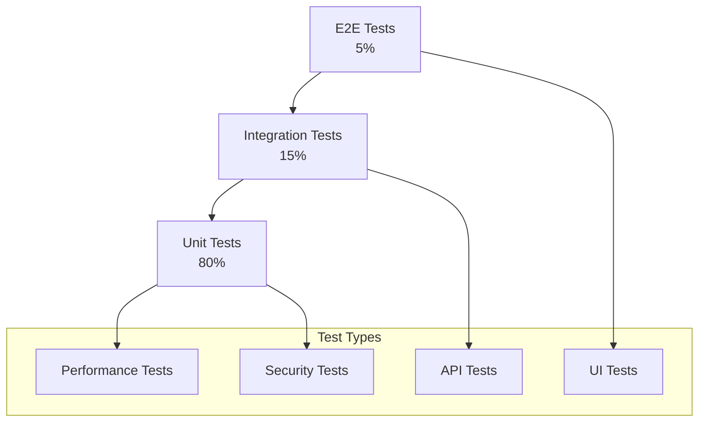
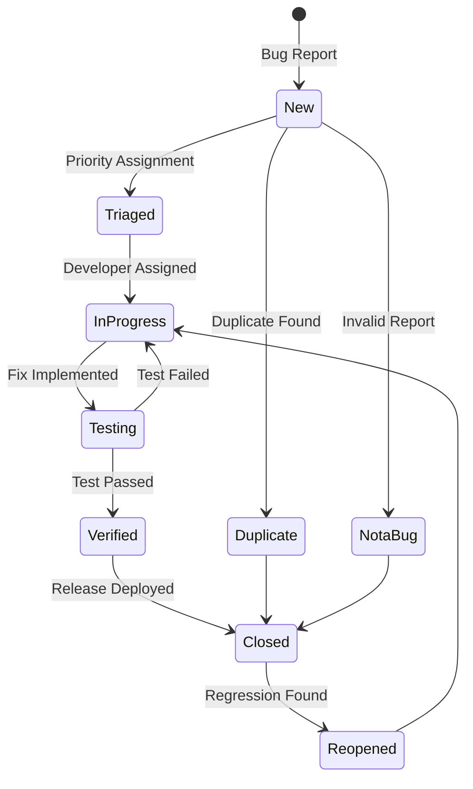

# Omniy 品質保証計画書

> **プロジェクト**: Omniy Instagram予約投稿アプリ  
> **バージョン**: 1.0  
> **作成日**: 2025-01-27  
> **承認者**: Claude PM  
> **ステータス**: 承認済み

---

## 📋 **品質保証概要**

本文書は、Omniy の品質保証戦略、テスト計画、品質基準、欠陥管理プロセスを定義します。1人運営MVP戦略に基づき、効率的で自動化されたテストプロセスを構築し、高品質なサービス提供を実現します。

### **品質保証基本方針**
- **Shift Left**: 早期段階での品質確保
- **自動化最優先**: 手動テストの最小化
- **継続的品質**: CI/CDパイプライン統合
- **ユーザー中心**: 実際の使用シナリオ重視
- **データ駆動**: メトリクスに基づく改善

---

## 🎯 **品質目標・基準**

### **品質目標**

#### **機能品質目標**
```yaml
正確性:
  - 投稿実行成功率: 99.5%以上
  - スケジュール精度: ±2分以内
  - データ整合性: 100%
  - 機能正常動作率: 99.9%以上

信頼性:
  - システム稼働率: 99.9%以上
  - 平均無故障時間: 720時間以上
  - 復旧時間: 1時間以内
  - データ損失: ゼロ

安全性:
  - セキュリティ脆弱性: ゼロ
  - 個人情報漏洩: ゼロ
  - 不正アクセス阻止: 100%
  - コンプライアンス準拠: 100%
```

#### **非機能品質目標**
```yaml
パフォーマンス:
  - ページロード時間: 3秒以内 (95%tile)
  - API応答時間: 500ms以内 (95%tile)
  - 同時ユーザー対応: 100名
  - リソース使用効率: 80%以上

使いやすさ:
  - 初回投稿完了時間: 5分以内
  - タスク完了率: 95%以上
  - ユーザーエラー率: 5%以下
  - ヘルプ参照率: 10%以下

保守性:
  - コードカバレッジ: 80%以上
  - Cyclomatic Complexity: 10以下
  - テクニカルデット比率: 5%以下
  - バグ修正時間: 平均24時間以内
```

### **品質ゲート**

#### **開発段階品質ゲート**
```yaml
コミット段階:
  - ✅ ESLint エラーゼロ
  - ✅ TypeScript型エラーゼロ
  - ✅ 単体テスト成功
  - ✅ セキュリティスキャン通過

プルリクエスト段階:
  - ✅ コードレビュー承認
  - ✅ 統合テスト成功
  - ✅ パフォーマンステスト通過
  - ✅ セキュリティテスト通過

リリース段階:
  - ✅ E2Eテスト成功
  - ✅ 受入テスト成功
  - ✅ 負荷テスト通過
  - ✅ 運用テスト完了
```

#### **品質ゲート実装**
```yaml
# GitHub Actions Quality Gate
name: Quality Gate
on: [pull_request]

jobs:
  quality-check:
    runs-on: ubuntu-latest
    steps:
      - name: Code Quality
        run: |
          npm run lint
          npm run type-check
          npm run test:unit
      
      - name: Security Scan
        uses: securecodewarrior/github-action-add-sarif@v1
        with:
          sarif-file: security-scan-results.sarif
      
      - name: Performance Test
        run: npm run test:performance
      
      - name: Quality Gate Evaluation
        run: |
          if [ "$COVERAGE" -lt 80 ]; then
            echo "❌ Coverage below 80%"
            exit 1
          fi
          if [ "$SECURITY_ISSUES" -gt 0 ]; then
            echo "❌ Security issues found"
            exit 1
          fi
          echo "✅ Quality gate passed"
```

---

## 🧪 **テスト戦略**

### **テストピラミッド**



#### **テスト分布目標**
```yaml
Unit Tests (80%):
  - 対象: 個別関数・コンポーネント
  - 実行頻度: 毎コミット
  - 実行時間: 30秒以内
  - カバレッジ: 90%以上

Integration Tests (15%):
  - 対象: API・データベース連携
  - 実行頻度: 毎プルリクエスト
  - 実行時間: 5分以内
  - カバレッジ: 主要フロー100%

E2E Tests (5%):
  - 対象: ユーザーシナリオ全体
  - 実行頻度: リリース前・日次
  - 実行時間: 30分以内
  - カバレッジ: クリティカルパス100%
```

### **テストレベル詳細**

#### **Unit Testing (単体テスト)**
```typescript
// Frontend Unit Test Example (Vitest)
import { describe, it, expect, vi } from 'vitest';
import { mount } from '@vue/test-utils';
import ScheduleFormDialog from '@/components/ScheduleFormDialog.vue';

describe('ScheduleFormDialog', () => {
  const mockStore = {
    createSchedule: vi.fn(),
    posts: [],
    igAccounts: []
  };

  it('should validate required fields', async () => {
    const wrapper = mount(ScheduleFormDialog, {
      global: {
        plugins: [createTestingPinia({
          initialState: mockStore
        })]
      }
    });

    const submitButton = wrapper.find('[data-testid="submit-button"]');
    await submitButton.trigger('click');

    expect(wrapper.find('.error-message').text()).toContain('投稿内容は必須です');
  });

  it('should create schedule with valid data', async () => {
    const wrapper = mount(ScheduleFormDialog, {
      global: {
        plugins: [createTestingPinia({
          initialState: mockStore
        })]
      }
    });

    await wrapper.find('[data-testid="caption-input"]').setValue('Test Caption');
    await wrapper.find('[data-testid="schedule-date"]').setValue('2025-02-01T10:00');
    await wrapper.find('[data-testid="submit-button"]').trigger('click');

    expect(mockStore.createSchedule).toHaveBeenCalledWith({
      caption: 'Test Caption',
      scheduledAt: expect.any(Date),
      type: 'once'
    });
  });
});

// Backend Unit Test Example (Jest)
import { validateScheduleInput } from '../utils/scheduleValidation';

describe('Schedule Validation', () => {
  describe('validateScheduleInput', () => {
    it('should accept valid once schedule', () => {
      const input = {
        type: 'once',
        scheduledAt: new Date(Date.now() + 3600000), // 1 hour from now
        postId: 'valid-post-id',
        igAccountId: 'valid-ig-account'
      };

      expect(() => validateScheduleInput(input)).not.toThrow();
    });

    it('should reject past schedule time', () => {
      const input = {
        type: 'once',
        scheduledAt: new Date(Date.now() - 3600000), // 1 hour ago
        postId: 'valid-post-id',
        igAccountId: 'valid-ig-account'
      };

      expect(() => validateScheduleInput(input)).toThrow('Schedule time must be in the future');
    });

    it('should validate recurring schedule format', () => {
      const input = {
        type: 'recurring',
        repeatRule: {
          weekdays: [1, 3, 5],
          time: '10:00',
          timezone: 'Asia/Tokyo'
        },
        postId: 'valid-post-id',
        igAccountId: 'valid-ig-account'
      };

      expect(() => validateScheduleInput(input)).not.toThrow();
    });
  });
});
```

#### **Integration Testing (統合テスト)**
```typescript
// API Integration Test
import { describe, it, expect, beforeAll, afterAll } from '@jest/globals';
import { initializeTestApp, clearFirestoreData } from '@firebase/rules-unit-testing';
import request from 'supertest';
import { app } from '../src/index';

describe('Schedules API Integration', () => {
  let testApp: any;
  let authToken: string;

  beforeAll(async () => {
    testApp = initializeTestApp({
      projectId: 'omniy-test',
      auth: { uid: 'test-user', email: 'test@example.com' }
    });
    
    // Get test auth token
    authToken = await testApp.auth().currentUser.getIdToken();
  });

  afterAll(async () => {
    await clearFirestoreData({ projectId: 'omniy-test' });
    await testApp.delete();
  });

  describe('POST /api/schedules', () => {
    it('should create new schedule', async () => {
      const scheduleData = {
        name: 'Test Schedule',
        type: 'once',
        scheduledAt: new Date(Date.now() + 3600000).toISOString(),
        postId: 'test-post-id',
        igAccountId: 'test-ig-account'
      };

      const response = await request(app)
        .post('/api/v1/schedules')
        .set('Authorization', `Bearer ${authToken}`)
        .send(scheduleData)
        .expect(201);

      expect(response.body.success).toBe(true);
      expect(response.body.schedule.id).toBeDefined();
      expect(response.body.schedule.status).toBe('active');
    });

    it('should enforce plan limits', async () => {
      // Create 10 schedules (free plan limit)
      for (let i = 0; i < 10; i++) {
        await request(app)
          .post('/api/v1/schedules')
          .set('Authorization', `Bearer ${authToken}`)
          .send({
            name: `Schedule ${i}`,
            type: 'once',
            scheduledAt: new Date(Date.now() + 3600000 + i * 1000).toISOString(),
            postId: 'test-post-id',
            igAccountId: 'test-ig-account'
          })
          .expect(201);
      }

      // 11th schedule should fail
      const response = await request(app)
        .post('/api/v1/schedules')
        .set('Authorization', `Bearer ${authToken}`)
        .send({
          name: 'Schedule 11',
          type: 'once',
          scheduledAt: new Date(Date.now() + 3600000).toISOString(),
          postId: 'test-post-id',
          igAccountId: 'test-ig-account'
        })
        .expect(429);

      expect(response.body.error).toContain('Schedule limit reached');
    });
  });
});

// Database Integration Test
describe('Firestore Integration', () => {
  it('should handle concurrent schedule updates', async () => {
    const scheduleId = 'concurrent-test-schedule';
    
    // Create initial schedule
    await admin.firestore()
      .collection('schedules')
      .doc(scheduleId)
      .set({
        status: 'active',
        retryCount: 0,
        lastRunAt: null
      });

    // Simulate concurrent updates
    const promises = Array.from({ length: 10 }, (_, i) => 
      admin.firestore().runTransaction(async (transaction) => {
        const scheduleRef = admin.firestore().collection('schedules').doc(scheduleId);
        const schedule = await transaction.get(scheduleRef);
        
        transaction.update(scheduleRef, {
          retryCount: schedule.data()!.retryCount + 1,
          lastUpdate: admin.firestore.FieldValue.serverTimestamp()
        });
      })
    );

    await Promise.all(promises);

    // Verify final state
    const finalSchedule = await admin.firestore()
      .collection('schedules')
      .doc(scheduleId)
      .get();

    expect(finalSchedule.data()!.retryCount).toBe(10);
  });
});
```

#### **E2E Testing (エンドツーエンドテスト)**
```typescript
// Cypress E2E Test
describe('Schedule Management Flow', () => {
  beforeEach(() => {
    // Login with test user
    cy.login('test@example.com', 'password123');
    cy.visit('/dashboard');
  });

  it('should complete full schedule creation flow', () => {
    // Navigate to schedules
    cy.get('[data-testid="nav-schedules"]').click();
    cy.url().should('include', '/schedules');

    // Create new schedule
    cy.get('[data-testid="create-schedule-button"]').click();
    
    // Fill schedule form
    cy.get('[data-testid="schedule-name-input"]').type('E2E Test Schedule');
    cy.get('[data-testid="caption-input"]').type('This is a test post caption #test');
    
    // Upload test image
    cy.get('[data-testid="image-upload"]').selectFile('cypress/fixtures/test-image.jpg');
    cy.get('[data-testid="image-preview"]').should('be.visible');
    
    // Set schedule time (1 hour from now)
    const futureTime = new Date(Date.now() + 3600000);
    cy.get('[data-testid="schedule-date"]').type(futureTime.toISOString().slice(0, 16));
    
    // Select Instagram account
    cy.get('[data-testid="ig-account-select"]').click();
    cy.get('[data-testid="ig-account-option"]').first().click();
    
    // Submit schedule
    cy.get('[data-testid="submit-schedule"]').click();
    
    // Verify success
    cy.get('[data-testid="success-message"]').should('contain', 'スケジュールが作成されました');
    cy.get('[data-testid="schedule-list"]').should('contain', 'E2E Test Schedule');
  });

  it('should handle form validation errors', () => {
    cy.get('[data-testid="nav-schedules"]').click();
    cy.get('[data-testid="create-schedule-button"]').click();
    
    // Try to submit empty form
    cy.get('[data-testid="submit-schedule"]').click();
    
    // Check validation errors
    cy.get('[data-testid="error-schedule-name"]').should('contain', '名前は必須です');
    cy.get('[data-testid="error-caption"]').should('contain', 'キャプションは必須です');
    cy.get('[data-testid="error-schedule-time"]').should('contain', '投稿時間は必須です');
  });

  it('should show plan limitation warning', () => {
    // Mock user with free plan reaching limit
    cy.intercept('GET', '/api/v1/user/limits', {
      fixture: 'user-limits-reached.json'
    });

    cy.get('[data-testid="nav-schedules"]').click();
    cy.get('[data-testid="create-schedule-button"]').click();
    
    cy.get('[data-testid="plan-limit-warning"]').should('be.visible');
    cy.get('[data-testid="upgrade-button"]').should('be.visible');
  });
});

// Playwright E2E Test (Alternative)
import { test, expect } from '@playwright/test';

test.describe('Instagram Account Management', () => {
  test.beforeEach(async ({ page }) => {
    await page.goto('/login');
    await page.fill('[data-testid="email-input"]', 'test@example.com');
    await page.fill('[data-testid="password-input"]', 'password123');
    await page.click('[data-testid="login-button"]');
    await page.waitForURL('/dashboard');
  });

  test('should connect Instagram account', async ({ page }) => {
    await page.click('[data-testid="nav-accounts"]');
    await page.click('[data-testid="add-account-button"]');
    
    // Mock Instagram OAuth flow
    await page.route('**/oauth/instagram/**', route => {
      route.fulfill({
        status: 200,
        body: JSON.stringify({
          access_token: 'mock_access_token',
          user_id: 'mock_user_id'
        })
      });
    });
    
    await page.click('[data-testid="connect-instagram"]');
    
    // Verify account added
    await expect(page.locator('[data-testid="account-list"]')).toContainText('@test_account');
    await expect(page.locator('[data-testid="account-status"]')).toContainText('接続済み');
  });
});
```

#### **Performance Testing (性能テスト)**
```typescript
// Load Testing with k6
import http from 'k6/http';
import { check, sleep } from 'k6';
import { Rate } from 'k6/metrics';

export let errorRate = new Rate('errors');

export let options = {
  stages: [
    { duration: '2m', target: 100 }, // Ramp up to 100 users
    { duration: '5m', target: 100 }, // Stay at 100 users
    { duration: '2m', target: 200 }, // Ramp up to 200 users
    { duration: '5m', target: 200 }, // Stay at 200 users
    { duration: '2m', target: 0 },   // Ramp down to 0 users
  ],
  thresholds: {
    http_req_duration: ['p(95)<500'], // 95% of requests must complete below 500ms
    errors: ['rate<0.1'], // Error rate must be below 10%
  },
};

export default function() {
  const BASE_URL = 'https://omniy-dev.web.app';
  
  // Login
  const loginResponse = http.post(`${BASE_URL}/api/v1/auth/login`, {
    email: 'loadtest@example.com',
    password: 'password123'
  });
  
  check(loginResponse, {
    'login status is 200': (r) => r.status === 200,
    'login response time < 2s': (r) => r.timings.duration < 2000,
  }) || errorRate.add(1);
  
  const authToken = loginResponse.json('token');
  const headers = { Authorization: `Bearer ${authToken}` };
  
  // Get schedules
  const schedulesResponse = http.get(`${BASE_URL}/api/v1/schedules`, { headers });
  
  check(schedulesResponse, {
    'schedules status is 200': (r) => r.status === 200,
    'schedules response time < 500ms': (r) => r.timings.duration < 500,
  }) || errorRate.add(1);
  
  // Create schedule
  const createResponse = http.post(`${BASE_URL}/api/v1/schedules`, {
    name: `Load Test Schedule ${__VU}_${__ITER}`,
    type: 'once',
    scheduledAt: new Date(Date.now() + 3600000).toISOString(),
    postId: 'load-test-post',
    igAccountId: 'load-test-account'
  }, { headers });
  
  check(createResponse, {
    'create status is 201': (r) => r.status === 201,
    'create response time < 1s': (r) => r.timings.duration < 1000,
  }) || errorRate.add(1);
  
  sleep(1);
}
```

#### **Security Testing (セキュリティテスト)**
```typescript
// Security Test Suite
describe('Security Tests', () => {
  describe('Authentication & Authorization', () => {
    it('should reject requests without authentication', async () => {
      const response = await request(app)
        .get('/api/v1/schedules')
        .expect(401);
      
      expect(response.body.error).toContain('Authentication required');
    });

    it('should reject expired tokens', async () => {
      const expiredToken = jwt.sign(
        { uid: 'test-user' },
        'secret',
        { expiresIn: '-1h' }
      );

      const response = await request(app)
        .get('/api/v1/schedules')
        .set('Authorization', `Bearer ${expiredToken}`)
        .expect(401);
      
      expect(response.body.error).toContain('Token expired');
    });

    it('should prevent access to other users data', async () => {
      const user1Token = await getTestToken('user1');
      const user2Token = await getTestToken('user2');
      
      // Create schedule as user1
      const createResponse = await request(app)
        .post('/api/v1/schedules')
        .set('Authorization', `Bearer ${user1Token}`)
        .send(validScheduleData)
        .expect(201);
      
      const scheduleId = createResponse.body.schedule.id;
      
      // Try to access as user2
      await request(app)
        .get(`/api/v1/schedules/${scheduleId}`)
        .set('Authorization', `Bearer ${user2Token}`)
        .expect(403);
    });
  });

  describe('Input Validation', () => {
    it('should prevent SQL injection attempts', async () => {
      const maliciousInput = "'; DROP TABLE users; --";
      
      const response = await request(app)
        .post('/api/v1/schedules')
        .set('Authorization', `Bearer ${validToken}`)
        .send({
          name: maliciousInput,
          type: 'once',
          scheduledAt: new Date().toISOString(),
          postId: 'test-post',
          igAccountId: 'test-account'
        })
        .expect(400);
      
      expect(response.body.error).toContain('Invalid input');
    });

    it('should prevent XSS attacks', async () => {
      const xssPayload = '<script>alert("xss")</script>';
      
      const response = await request(app)
        .post('/api/v1/schedules')
        .set('Authorization', `Bearer ${validToken}`)
        .send({
          name: xssPayload,
          type: 'once',
          scheduledAt: new Date().toISOString(),
          postId: 'test-post',
          igAccountId: 'test-account'
        })
        .expect(400);
      
      expect(response.body.error).toContain('Invalid characters');
    });
  });

  describe('Rate Limiting', () => {
    it('should enforce API rate limits', async () => {
      const promises = Array.from({ length: 1001 }, () =>
        request(app)
          .get('/api/v1/schedules')
          .set('Authorization', `Bearer ${validToken}`)
      );

      const responses = await Promise.all(promises);
      const rateLimitedResponses = responses.filter(r => r.status === 429);
      
      expect(rateLimitedResponses.length).toBeGreaterThan(0);
    });
  });
});

// Automated Security Scanning
const securityScanConfig = {
  target: 'https://omniy-dev.web.app',
  tests: [
    'owasp-top-10',
    'sql-injection',
    'xss-detection',
    'authentication-bypass',
    'authorization-flaws',
    'csrf-vulnerabilities'
  ],
  authentication: {
    type: 'oauth',
    credentials: process.env.TEST_CREDENTIALS
  }
};
```

---

## 🐛 **欠陥管理プロセス**

### **バグ分類・優先度**

#### **Severity (深刻度)**
```yaml
Critical (S1):
  - システム停止・クラッシュ
  - データ損失・破損
  - セキュリティ脆弱性
  - 決済機能停止

High (S2):
  - 主要機能の停止
  - パフォーマンス大幅低下
  - データ不整合
  - 多数ユーザーへの影響

Medium (S3):
  - 機能の部分的問題
  - 軽微なパフォーマンス問題
  - UI/UXの問題
  - 回避策あり

Low (S4):
  - 軽微な表示問題
  - ドキュメントの誤記
  - 将来の機能要望
  - 非重要機能の問題
```

#### **Priority (優先度)**
```yaml
P0 (Immediate):
  - 即座修正必要 (24時間以内)
  - リリースブロック要因
  - ビジネス継続に影響

P1 (High):
  - 急ぎ修正必要 (1週間以内)
  - 次回リリースに含める
  - ユーザー体験に大きな影響

P2 (Medium):
  - 通常修正 (1ヶ月以内)
  - 計画的修正対応
  - 軽微なユーザー影響

P3 (Low):
  - 時間のある時に修正
  - バックログで管理
  - 影響は限定的
```

### **バグライフサイクル**



### **バグレポート基準**

#### **バグレポートテンプレート**
```yaml
Bug Report Template:
  
  Title: [Clear, concise description]
  
  Priority: P0/P1/P2/P3
  Severity: S1/S2/S3/S4
  Component: Frontend/Backend/API/Database
  
  Environment:
    - Browser: Chrome 120.0.0.0
    - OS: macOS 14.0
    - URL: https://omniy.com/schedules
    - User: test@example.com
  
  Steps to Reproduce:
    1. Navigate to /schedules
    2. Click "Create Schedule"
    3. Fill in required fields
    4. Click "Submit"
  
  Expected Result:
    Schedule should be created successfully
  
  Actual Result:
    Error message "Internal Server Error" appears
  
  Screenshots/Videos:
    [Attach relevant media]
  
  Console Errors:
    [Include browser console errors]
  
  Additional Information:
    - Error occurs only with recurring schedules
    - Works fine for one-time schedules
    - Reproducible 100% of the time
```

#### **バグトリアージプロセス**
```yaml
Daily Triage (30分):
  1. 新規バグレポート確認
  2. 重複チェック
  3. 優先度・深刻度決定
  4. 担当者アサイン
  5. 修正予定日設定

Weekly Review (1時間):
  1. 未解決バグ一覧確認
  2. 優先度見直し
  3. 進捗状況確認
  4. ブロッカー特定
  5. リソース再配分

Monthly Analysis (2時間):
  1. バグトレンド分析
  2. 品質メトリクス確認
  3. プロセス改善検討
  4. ツール最適化検討
```

---

## 📊 **品質メトリクス・測定**

### **品質メトリクス一覧**

#### **プロセスメトリクス**
```yaml
テスト効率:
  - テスト実行時間: 目標30分以内
  - テスト自動化率: 目標90%以上
  - テストカバレッジ: 目標80%以上
  - テスト成功率: 目標95%以上

欠陥メトリクス:
  - 欠陥検出率: 月間バグ発見数
  - 欠陥漏れ率: 本番環境バグ数
  - 修正時間: バグ報告から修正まで
  - 再発率: 同じバグの再発頻度

開発効率:
  - コードレビュー時間: 平均2時間以内
  - デプロイ頻度: 週1回以上
  - 変更失敗率: 目標5%以下
  - 復旧時間: 平均1時間以内
```

#### **プロダクトメトリクス**
```yaml
機能品質:
  - 機能正常動作率: 99.9%
  - 投稿成功率: 99.5%
  - API応答時間: 500ms以内
  - ページロード時間: 3秒以内

ユーザー品質:
  - タスク完了率: 95%以上
  - ユーザーエラー率: 5%以下
  - ヘルプ参照率: 10%以下
  - ユーザー満足度: 4.0/5.0以上

システム品質:
  - 稼働率: 99.9%以上
  - セキュリティ事故: ゼロ
  - データ損失: ゼロ
  - コンプライアンス違反: ゼロ
```

### **品質ダッシュボード**

#### **リアルタイム品質監視**
```typescript
// Quality Metrics Dashboard
interface QualityMetrics {
  timestamp: Date;
  testExecution: {
    totalTests: number;
    passedTests: number;
    failedTests: number;
    executionTime: number;
    coverage: number;
  };
  defects: {
    openBugs: number;
    criticalBugs: number;
    avgResolutionTime: number;
    bugTrend: number[];
  };
  performance: {
    apiResponseTime: number;
    pageLoadTime: number;
    errorRate: number;
    uptime: number;
  };
  userExperience: {
    taskCompletionRate: number;
    userErrorRate: number;
    satisfactionScore: number;
    supportTickets: number;
  };
}

class QualityDashboard {
  async getQualityMetrics(): Promise<QualityMetrics> {
    const [testResults, defectData, performanceData, uxData] = await Promise.all([
      this.getTestExecutionMetrics(),
      this.getDefectMetrics(),
      this.getPerformanceMetrics(),
      this.getUserExperienceMetrics()
    ]);

    return {
      timestamp: new Date(),
      testExecution: testResults,
      defects: defectData,
      performance: performanceData,
      userExperience: uxData
    };
  }

  async generateQualityReport(period: 'daily' | 'weekly' | 'monthly'): Promise<QualityReport> {
    const metrics = await this.getQualityMetricsHistory(period);
    
    const report = {
      period,
      summary: this.calculateQualitySummary(metrics),
      trends: this.analyzeQualityTrends(metrics),
      recommendations: this.generateRecommendations(metrics),
      actionItems: this.identifyActionItems(metrics)
    };

    return report;
  }
}
```

#### **品質レポート自動生成**
```yaml
Daily Quality Report:
  Recipients: Claude PM, sh
  Time: 9:00 AM JST
  Content:
    - Previous day test results
    - New bugs reported
    - Performance metrics
    - User experience metrics

Weekly Quality Report:
  Recipients: All stakeholders
  Time: Monday 9:00 AM JST
  Content:
    - Quality trend analysis
    - Bug resolution summary
    - Performance benchmarks
    - Improvement recommendations

Monthly Quality Report:
  Recipients: Management team
  Time: 1st Monday of month
  Content:
    - Quality goals achievement
    - Process improvement results
    - Resource optimization
    - Strategic recommendations
```

---

## 🔄 **継続的品質改善**

### **品質改善プロセス**

#### **Plan-Do-Check-Act (PDCA)**
```yaml
Plan (計画):
  - 品質目標設定
  - 改善施策立案
  - リソース計画
  - スケジュール策定

Do (実行):
  - 改善施策実装
  - テスト実行
  - データ収集
  - プロセス実行

Check (確認):
  - 結果測定・分析
  - 目標達成度評価
  - 問題点特定
  - 効果検証

Act (改善):
  - 成功事例標準化
  - 問題点改善策
  - プロセス更新
  - 次期計画策定
```

#### **品質改善活動例**
```yaml
テスト自動化推進:
  目標: 手動テスト工数50%削減
  施策:
    - E2Eテスト自動化
    - Visual regression testing導入
    - API テスト自動化
    - 並列テスト実行

コード品質向上:
  目標: 技術的負債20%削減
  施策:
    - 静的解析ツール強化
    - コードレビュー基準厳格化
    - リファクタリング定期実施
    - アーキテクチャ改善

ユーザー体験向上:
  目標: ユーザー満足度4.5/5.0達成
  施策:
    - ユーザビリティテスト実施
    - パフォーマンス最適化
    - エラーメッセージ改善
    - オンボーディング強化
```

### **品質改善のためのツール・技術**

#### **品質分析ツール**
```yaml
Code Quality:
  - SonarQube: 静的解析・技術的負債分析
  - ESLint: JavaScript/TypeScript品質チェック
  - Prettier: コードフォーマット統一
  - CodeClimate: 保守性・重複度分析

Testing Tools:
  - Jest: Unit testing framework
  - Vitest: Fast unit testing for Vite
  - Cypress: E2E testing framework
  - Playwright: Cross-browser testing
  - k6: Load testing tool

Monitoring Tools:
  - Lighthouse CI: Performance monitoring
  - Sentry: Error tracking & monitoring
  - LogRocket: User session recording
  - Firebase Performance: Real user monitoring
```

#### **品質自動化パイプライン**
```yaml
# .github/workflows/quality-pipeline.yml
name: Quality Pipeline

on: [push, pull_request]

jobs:
  static-analysis:
    runs-on: ubuntu-latest
    steps:
      - uses: actions/checkout@v3
      - name: Setup Node.js
        uses: actions/setup-node@v3
        with:
          node-version: '18'
      
      - name: Install dependencies
        run: npm ci
      
      - name: Run ESLint
        run: npm run lint
      
      - name: Run TypeScript check
        run: npm run type-check
      
      - name: SonarQube analysis
        uses: sonarqube-quality-gate-action@master
        env:
          SONAR_TOKEN: ${{ secrets.SONAR_TOKEN }}

  unit-tests:
    runs-on: ubuntu-latest
    steps:
      - uses: actions/checkout@v3
      - name: Setup Node.js
        uses: actions/setup-node@v3
        with:
          node-version: '18'
      
      - name: Install dependencies
        run: npm ci
      
      - name: Run unit tests
        run: npm run test:unit -- --coverage
      
      - name: Upload coverage to Codecov
        uses: codecov/codecov-action@v3

  integration-tests:
    runs-on: ubuntu-latest
    services:
      firebase-emulator:
        image: firebase/emulator-suite
        ports:
          - 8080:8080
          - 9099:9099
    steps:
      - uses: actions/checkout@v3
      - name: Setup Node.js
        uses: actions/setup-node@v3
        with:
          node-version: '18'
      
      - name: Install dependencies
        run: npm ci
      
      - name: Run integration tests
        run: npm run test:integration

  e2e-tests:
    runs-on: ubuntu-latest
    steps:
      - uses: actions/checkout@v3
      - name: Setup Node.js
        uses: actions/setup-node@v3
        with:
          node-version: '18'
      
      - name: Install dependencies
        run: npm ci
      
      - name: Build application
        run: npm run build
      
      - name: Run E2E tests
        uses: cypress-io/github-action@v5
        with:
          start: npm run serve
          wait-on: 'http://localhost:3000'

  performance-tests:
    runs-on: ubuntu-latest
    steps:
      - uses: actions/checkout@v3
      - name: Run Lighthouse CI
        uses: treosh/lighthouse-ci-action@v9
        with:
          configPath: './lighthouserc.js'
          uploadArtifacts: true

  security-scan:
    runs-on: ubuntu-latest
    steps:
      - uses: actions/checkout@v3
      - name: Run Trivy vulnerability scanner
        uses: aquasecurity/trivy-action@master
        with:
          scan-type: 'fs'
          scan-ref: '.'
          format: 'sarif'
          output: 'trivy-results.sarif'
      
      - name: Upload Trivy scan results
        uses: github/codeql-action/upload-sarif@v2
        with:
          sarif_file: 'trivy-results.sarif'
```

---

## ✅ **品質保証承認・効力発効**

### **品質計画承認**
```yaml
品質レビュー:
  作成者: Claude PM
  レビュー日: 2025-01-27
  承認者: sh (Product Owner)
  承認日: 2025-01-27

品質目標承認:
  - テストカバレッジ: ✅ 80%で承認
  - 自動化率: ✅ 90%で承認
  - バグ解決時間: ✅ 24時間以内で承認
  - ユーザー満足度: ✅ 4.0/5.0で承認

品質プロセス承認:
  - テスト戦略: ✅ 承認
  - 欠陥管理プロセス: ✅ 承認
  - 品質メトリクス: ✅ 承認
  - 改善プロセス: ✅ 承認

次回レビュー予定:
  - 月次: 2025-02-27 (品質メトリクス確認)
  - 四半期: 2025-04-27 (品質計画見直し)
  - 年次: 2025-12-27 (全面見直し)
```

### **品質保証体制確立**
```yaml
品質責任者: Claude PM
品質保証チーム: Claude PM (兼任)
外部品質監査: 年1回実施
品質ツール: 設定完了・運用開始

開始準備完了:
  - [ ] テスト環境構築
  - [ ] 自動テストスイート実装
  - [ ] 品質監視ダッシュボード構築
  - [ ] 欠陥管理システム設定
  - [ ] 品質メトリクス収集開始
```

---

**この品質保証計画書に基づき、高品質なサービス提供を実現します。**  
**継続的な改善により、ユーザー満足度とシステム信頼性の向上を図ります。**

---
*Document ID: QA-001*  
*Classification: Internal*  
*Distribution: sh, Claude PM, Development Team*