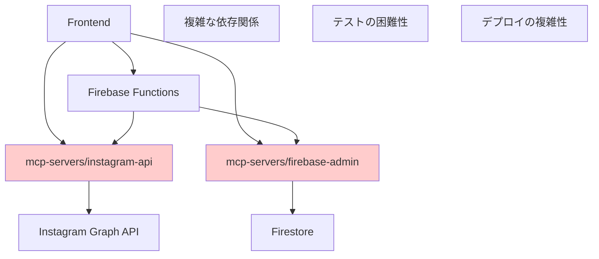
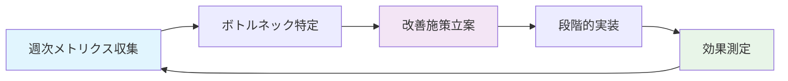

Claude Rules :look👀

# Omniy 段階的リファクタリング戦略

## 🎯 戦略概要

### 現状課題
- **機能過多**: 1人運営には複雃すぎる（20機能→6機能に削減必要）
- **技術的負債**: mcp-servers連携、複雑なAPI構造
- **保守性**: 新機能追加の度に全体への影響リスク

### 戦略原則
1. **ゼロダウンタイム**: 既存ユーザーへの影響最小化
2. **段階的移行**: ストラングラーフィグパターンによる安全な移行
3. **後方互換性**: 既存APIの漸進的廃止
4. **測定可能性**: 各段階での成果指標明確化

---

## 🚀 Phase 1: 即時安全化（2週間）

### A. フィーチャーフラグによる安全な機能制御

#### 実装: 動的機能制御システム
```typescript
// frontend/src/composables/useFeatureFlags.ts
interface FeatureConfig {
  enabled: boolean
  userTiers?: string[]  // ['free', 'basic', 'pro']
  rolloutPercentage?: number
  killSwitch?: boolean  // 緊急停止用
}

interface FeatureFlags {
  // MVP Core (常時有効)
  BASIC_SCHEDULING: FeatureConfig
  CONTENT_LIBRARY: FeatureConfig
  INSTAGRAM_AUTH: FeatureConfig
  STRIPE_BILLING: FeatureConfig
  
  // 段階的削除対象
  RANDOM_POSTING: FeatureConfig
  PROXY_MANAGEMENT: FeatureConfig
  GROUP_MANAGEMENT: FeatureConfig
  LOGS_DASHBOARD: FeatureConfig
  CALENDAR_VIEW: FeatureConfig
  PERFORMANCE_METRICS: FeatureConfig
}

export function useFeatureFlags() {
  const flags = ref<FeatureFlags>({
    BASIC_SCHEDULING: { enabled: true },
    CONTENT_LIBRARY: { enabled: true },
    INSTAGRAM_AUTH: { enabled: true },
    STRIPE_BILLING: { enabled: true },
    
    // 段階的廃止（第1段階: UI非表示）
    RANDOM_POSTING: { 
      enabled: false, 
      killSwitch: true,
      rolloutPercentage: 0 
    },
    PROXY_MANAGEMENT: { enabled: false, killSwitch: true },
    GROUP_MANAGEMENT: { enabled: false, killSwitch: true },
    LOGS_DASHBOARD: { enabled: false, killSwitch: true },
    CALENDAR_VIEW: { enabled: false, killSwitch: true },
    PERFORMANCE_METRICS: { enabled: false, killSwitch: true }
  })

  // リモート設定対応（Firestore Remote Config）
  const updateFlagsFromRemote = async () => {
    try {
      const remoteFlags = await fetchRemoteConfig()
      Object.assign(flags.value, remoteFlags)
    } catch (error) {
      console.warn('Failed to fetch remote feature flags, using defaults')
    }
  }

  const isFeatureEnabled = (feature: keyof FeatureFlags): boolean => {
    const config = flags.value[feature]
    if (config.killSwitch) return false
    if (config.rolloutPercentage && Math.random() * 100 > config.rolloutPercentage) {
      return false
    }
    return config.enabled
  }

  return {
    flags: readonly(flags),
    isFeatureEnabled,
    updateFlagsFromRemote
  }
}
```

#### 実装: コンポーネントレベル制御
```vue
<!-- frontend/src/components/NavigationDrawer.vue -->
<template>
  <v-navigation-drawer>
    <v-list>
      <!-- MVP Core (常時表示) -->
      <v-list-item to="/dashboard">
        <v-list-item-icon><v-icon>mdi-view-dashboard</v-icon></v-list-item-icon>
        <v-list-item-content>ダッシュボード</v-list-item-content>
      </v-list-item>
      
      <v-list-item to="/schedules">
        <v-list-item-icon><v-icon>mdi-calendar-clock</v-icon></v-list-item-icon>
        <v-list-item-content>予約投稿</v-list-item-content>
      </v-list-item>
      
      <!-- 段階的廃止対象（フラグ制御） -->
      <v-list-item 
        v-if="isFeatureEnabled('CALENDAR_VIEW')"
        to="/calendar"
        class="deprecated-feature"
      >
        <v-list-item-icon><v-icon>mdi-calendar</v-icon></v-list-item-icon>
        <v-list-item-content>
          カレンダー
          <v-chip x-small color="orange" text-color="white">廃止予定</v-chip>
        </v-list-item-content>
      </v-list-item>
      
      <v-list-item 
        v-if="isFeatureEnabled('PROXY_MANAGEMENT')"
        to="/proxies"
        class="deprecated-feature"
      >
        <v-list-item-icon><v-icon>mdi-server</v-icon></v-list-item-icon>
        <v-list-item-content>
          プロキシ管理
          <v-chip x-small color="red" text-color="white">2025/3/1 廃止</v-chip>
        </v-list-item-content>
      </v-list-item>
    </v-list>
  </v-navigation-drawer>
</template>

<script setup lang="ts">
import { useFeatureFlags } from '@/composables/useFeatureFlags'

const { isFeatureEnabled } = useFeatureFlags()
</script>

<style scoped>
.deprecated-feature {
  opacity: 0.6;
  background-color: #fff3e0;
}
</style>
```

### B. API版源管理とレガシー隔離

#### 実装: バージョニング戦略
```typescript
// functions/src/api/v2/schedules.ts (新版API)
/**
 * 簡略化されたスケジュール作成API v2
 * - 複雑な設定を排除
 * - 明確なエラーレスポンス
 * - 1人運営対応の自動制限
 */
export const createScheduleV2 = functions.https.onCall(async (data, context) => {
  // 認証・バリデーション（簡略化）
  const validation = await validateSimpleScheduleData(data, context)
  if (!validation.success) {
    throw new functions.https.HttpsError('invalid-argument', validation.error)
  }

  // 自動制限チェック（1人運営対応）
  const limits = await checkAutomaticLimits(context.auth!.uid)
  if (!limits.allowed) {
    throw new functions.https.HttpsError('resource-exhausted', limits.reason)
  }

  // シンプルなスケジュール作成
  const schedule = await createSimplifiedSchedule({
    userId: context.auth!.uid,
    caption: data.caption,
    mediaUrls: data.mediaUrls,
    scheduledAt: data.scheduledAt,
    isRecurring: data.isRecurring || false,
    repeatDays: data.repeatDays || []
  })

  return {
    success: true,
    scheduleId: schedule.id,
    scheduledAt: schedule.scheduledAt,
    estimatedCost: calculateSimpleCost(schedule)
  }
})

// functions/src/api/v1/schedules.ts (レガシー版 - 段階的廃止)
export const createSchedule = functions.https.onCall(async (data, context) => {
  // 廃止予告ヘッダー追加
  console.warn('API v1 is deprecated. Please migrate to v2 by 2025-04-01')
  
  // 既存の複雑なロジック（段階的無効化）
  if (data.features?.randomPosting) {
    throw new functions.https.HttpsError(
      'unimplemented', 
      'Random posting feature has been discontinued. Please use basic scheduling.'
    )
  }
  
  if (data.features?.proxyManagement) {
    throw new functions.https.HttpsError(
      'unimplemented',
      'Proxy management feature has been discontinued.'
    )
  }
  
  // 簡略化された処理に転送
  return createScheduleV2(data, context)
})
```

#### 実装: レガシーコード隔離
```typescript
// functions/src/legacy/README.md
/**
 * Legacy Code Isolation
 * 
 * このディレクトリには段階的廃止予定の機能を配置
 * - 2025-03-01: 機能停止予告
 * - 2025-04-01: API廃止
 * - 2025-05-01: コード削除
 */

// functions/src/legacy/random-posting.ts
export class RandomPostingService {
  constructor() {
    console.warn('RandomPostingService is deprecated and will be removed on 2025-05-01')
  }
  
  async scheduleRandomPost(): Promise<never> {
    throw new Error('Random posting feature has been discontinued')
  }
}

// functions/src/legacy/proxy-management.ts  
export class ProxyManagementService {
  constructor() {
    console.warn('ProxyManagementService is deprecated and will be removed on 2025-05-01')
  }
  
  async configureProxy(): Promise<never> {
    throw new Error('Proxy management feature has been discontinued')
  }
}
```

---

## 🔄 Phase 2: 構造的リファクタリング（4週間）

### A. mcp-servers アーキテクチャ最適化

#### 現状問題分析


#### 解決策: Adapter Pattern による統合
```typescript
// functions/src/adapters/instagram-adapter.ts
/**
 * Instagram操作の統一インターフェース
 * mcp-serversの複雑性を隠蔽し、シンプルなAPIを提供
 */
export interface InstagramAdapter {
  publishPost(request: PublishRequest): Promise<PublishResult>
  schedulePost(request: ScheduleRequest): Promise<ScheduleResult>
  getAccountInfo(accountId: string): Promise<AccountInfo>
  validateToken(token: string): Promise<TokenValidation>
}

export class SimplifiedInstagramAdapter implements InstagramAdapter {
  private mcpClient: InstagramMCPClient | null = null
  private fallbackClient: DirectInstagramClient | null = null

  constructor() {
    // MCP利用可能時は優先、フォールバック対応
    if (this.isMCPAvailable()) {
      this.mcpClient = new InstagramMCPClient()
    } else {
      this.fallbackClient = new DirectInstagramClient()
    }
  }

  async publishPost(request: PublishRequest): Promise<PublishResult> {
    try {
      if (this.mcpClient) {
        return await this.mcpClient.publishPost(request)
      } else {
        return await this.fallbackClient!.publishPost(request)
      }
    } catch (error) {
      // フォールバック機構
      if (this.mcpClient && this.fallbackClient) {
        console.warn('MCP client failed, falling back to direct client')
        return await this.fallbackClient.publishPost(request)
      }
      throw error
    }
  }

  private isMCPAvailable(): boolean {
    return process.env.NODE_ENV !== 'production' || 
           process.env.ENABLE_MCP_INTEGRATION === 'true'
  }
}
```

### B. データモデル正規化

#### 現状の課題
```typescript
// 現在: 複雑な入れ子構造
interface ComplexSchedule {
  id: string
  userId: string
  content: {
    caption: string
    mediaUrls: string[]
    hashtags: string[]
    location?: GeoLocation
    mentions: UserMention[]
  }
  timing: {
    scheduledAt?: Date
    isRecurring: boolean
    repeatRule?: {
      dayOfWeek: number[]
      hour: number
      minute: number
      timezone: string
      endDate?: Date
    }
    randomRule?: {
      minInterval: number
      maxInterval: number
      timeWindows: TimeWindow[]
    }
  }
  advanced: {
    proxyConfig?: ProxyConfig
    groupSettings?: GroupSettings
    notificationSettings?: NotificationConfig
    performanceTracking?: PerformanceConfig
  }
  metadata: {
    createdAt: Date
    updatedAt: Date
    version: number
    migrationFlags: Record<string, boolean>
  }
}
```

#### 解決策: 正規化されたシンプルモデル
```typescript
// 新設: 正規化されたシンプルモデル
interface SimpleSchedule {
  readonly id: ScheduleId
  readonly userId: UserId
  readonly accountId: AccountId
  readonly caption: string
  readonly mediaUrls: string[]
  readonly scheduledAt: Date
  readonly isRecurring: boolean
  readonly repeatDays: number[]  // [1,3,5] = 月・水・金
  readonly status: 'pending' | 'executing' | 'completed' | 'failed'
  readonly createdAt: Date
  readonly updatedAt: Date
}

// 拡張機能は別テーブルで管理（必要に応じて）
interface ScheduleExtensions {
  readonly scheduleId: ScheduleId
  readonly hashtags?: string[]
  readonly location?: string
  readonly mentions?: string[]
  readonly notes?: string
}

// 実行ログは完全分離
interface ScheduleExecution {
  readonly id: ExecutionId
  readonly scheduleId: ScheduleId
  readonly executedAt: Date
  readonly status: 'success' | 'failed'
  readonly errorMessage?: string
  readonly instagramPostId?: string
  readonly processingTimeMs: number
}
```

### C. テスト戦略の体系化

#### 統合テストの簡略化
```typescript
// functions/__tests__/integration/simplified-schedule.test.ts
describe('Simplified Schedule Integration', () => {
  const testEnv = initializeTestEnvironment({
    projectId: 'omniy-test'
  })

  beforeAll(async () => {
    await testEnv.withSecurityRulesDisabled(async (context) => {
      await context.firestore()
        .collection('test-data')
        .doc('setup')
        .set({ initialized: true })
    })
  })

  test('should create simple schedule successfully', async () => {
    // Given: 認証済みユーザー
    const context = testEnv.authenticatedContext('user123')
    
    // When: シンプルなスケジュール作成
    const scheduleData = {
      caption: 'Test post',
      mediaUrls: ['https://example.com/image.jpg'],
      scheduledAt: new Date(Date.now() + 3600000), // 1時間後
      isRecurring: false,
      repeatDays: []
    }
    
    const result = await context.functions()
      .httpsCallable('createScheduleV2')(scheduleData)
    
    // Then: 成功レスポンス
    expect(result.data.success).toBe(true)
    expect(result.data.scheduleId).toBeDefined()
    
    // データベース確認
    const scheduleDoc = await context.firestore()
      .collection(`users/user123/schedules`)
      .doc(result.data.scheduleId)
      .get()
    
    expect(scheduleDoc.exists).toBe(true)
    expect(scheduleDoc.data()?.caption).toBe('Test post')
  })

  test('should reject invalid schedule data', async () => {
    const context = testEnv.authenticatedContext('user123')
    
    const invalidData = {
      caption: '', // 空文字は無効
      mediaUrls: [],
      scheduledAt: new Date(Date.now() - 3600000) // 過去の日時は無効
    }
    
    await expect(
      context.functions().httpsCallable('createScheduleV2')(invalidData)
    ).rejects.toThrow('invalid-argument')
  })
})
```

---

## 📊 Phase 3: パフォーマンス最適化（3週間）

### A. バンドル最適化と遅延読み込み

#### デモコンテンツの分離
```typescript
// frontend/src/utils/demo-loader.ts
/**
 * デモコンテンツの動的読み込み
 * 本番環境では完全に除外される
 */
export class DemoContentLoader {
  private static instance: DemoContentLoader
  private cache = new Map<string, any>()

  static getInstance(): DemoContentLoader {
    if (!DemoContentLoader.instance) {
      DemoContentLoader.instance = new DemoContentLoader()
    }
    return DemoContentLoader.instance
  }

  async loadDemoStyle(styleName: string): Promise<any> {
    // 本番環境では即座にエラー
    if (import.meta.env.PROD && !import.meta.env.VITE_ENABLE_DEMOS) {
      throw new Error('Demo content is not available in production')
    }

    // キャッシュ確認
    if (this.cache.has(styleName)) {
      return this.cache.get(styleName)
    }

    // 動的インポート
    try {
      const module = await import(`../views/demos/styles/${styleName}/index.ts`)
      this.cache.set(styleName, module.default)
      return module.default
    } catch (error) {
      console.warn(`Failed to load demo style: ${styleName}`)
      throw new Error(`Demo style '${styleName}' not found`)
    }
  }

  getAvailableStyles(): string[] {
    if (import.meta.env.PROD && !import.meta.env.VITE_ENABLE_DEMOS) {
      return []
    }
    
    return [
      'modern',
      'stylish', 
      'cyberpunk',
      'neumorphism',
      'glassmorphism',
      'minimalist',
      'retro-futuristic'
    ]
  }
}
```

#### Vite設定の最適化
```typescript
// frontend/vite.config.ts (追加最適化)
export default defineConfig({
  build: {
    rollupOptions: {
      output: {
        manualChunks: (id) => {
          // デモコンテンツの完全分離
          if (id.includes('/demos/')) {
            if (import.meta.env.PROD && !import.meta.env.VITE_ENABLE_DEMOS) {
              return undefined // 本番ビルドから除外
            }
            const styleName = id.match(/\/styles\/([^\/]+)\//)?.[1]
            return styleName ? `demo-${styleName}` : 'demo-common'
          }
          
          // Core機能の最適化
          if (id.includes('node_modules')) {
            if (id.includes('vue')) return 'vendor-vue'
            if (id.includes('vuetify')) return 'vendor-ui'
            if (id.includes('firebase')) return 'vendor-firebase'
            return 'vendor-misc'
          }
          
          // アプリケーションコード
          if (id.includes('/views/')) {
            if (id.includes('Dashboard') || id.includes('Schedule')) {
              return 'app-core'
            }
            return 'app-secondary'
          }
          
          return 'app-main'
        }
      }
    }
  },
  
  // デモコンテンツ除外プラグイン
  plugins: [
    // ... 既存プラグイン
    {
      name: 'exclude-demos-in-prod',
      generateBundle(options, bundle) {
        if (import.meta.env.PROD && !import.meta.env.VITE_ENABLE_DEMOS) {
          Object.keys(bundle).forEach(fileName => {
            if (fileName.includes('demo-')) {
              delete bundle[fileName]
            }
          })
        }
      }
    }
  ]
})
```

### B. Firebase Functions最適化

#### メモリ使用量とコールドスタート最適化
```typescript
// functions/src/config/runtime-optimization.ts
import { runWith } from 'firebase-functions'

/**
 * 関数別最適化設定
 * 1人運営での運用コスト削減重視
 */
export const OptimizedRuntime = {
  // 高頻度・軽量処理
  lightweightAPI: runWith({
    memory: '128MB',
    timeoutSeconds: 30,
    maxInstances: 10
  }),
  
  // 中頻度・標準処理
  standardAPI: runWith({
    memory: '256MB', 
    timeoutSeconds: 60,
    maxInstances: 5
  }),
  
  // 低頻度・重量処理
  heavyTask: runWith({
    memory: '512MB',
    timeoutSeconds: 300,
    maxInstances: 2
  })
}

// 使用例
export const createScheduleV2 = OptimizedRuntime.lightweightAPI
  .https.onCall(async (data, context) => {
    // シンプルな処理のため128MBで十分
  })

export const executeScheduledPosts = OptimizedRuntime.standardAPI
  .pubsub.schedule('every 1 minutes')
  .onRun(async (context) => {
    // Instagram API呼び出しのため256MB
  })

export const generateMonthlyReport = OptimizedRuntime.heavyTask
  .pubsub.schedule('0 0 1 * *')
  .onRun(async (context) => {
    // 大量データ処理のため512MB
  })
```

#### グローバル変数とコネクション管理
```typescript
// functions/src/utils/connection-management.ts
/**
 * Firebase Functions最適化パターン
 * グローバル変数でコネクション再利用
 */

// グローバルレベルでの初期化（コンテナ再利用）
let adminApp: admin.app.App | null = null
let instagramClient: InstagramGraphClient | null = null

export function getAdminApp(): admin.app.App {
  if (!adminApp) {
    adminApp = admin.initializeApp()
    console.log('Admin app initialized')
  }
  return adminApp
}

export function getInstagramClient(): InstagramGraphClient {
  if (!instagramClient) {
    instagramClient = new InstagramGraphClient({
      timeout: 30000,
      retryAttempts: 3,
      // コネクションプール設定
      maxConnections: 5,
      keepAlive: true
    })
    console.log('Instagram client initialized')
  }
  return instagramClient
}

// 使用例（関数内）
export const publishPost = OptimizedRuntime.standardAPI
  .https.onCall(async (data, context) => {
    // グローバル変数を再利用（コールドスタート削減）
    const db = getAdminApp().firestore()
    const instagram = getInstagramClient()
    
    // 実際の処理...
  })
```

---

## 📈 成果測定と継続改善

### KPI設定
```yaml
技術指標:
  - バンドルサイズ: 現在3.5MB → 目標2.0MB (43%削減)
  - 初期ロード時間: 現在1.8s → 目標1.0s (44%短縮)
  - Functions実行時間: 現在800ms → 目標400ms (50%短縮)
  - メモリ使用量: 現在512MB → 目標256MB (50%削減)

ビジネス指標:
  - サポート問い合わせ: 現在20件/月 → 目標6件/月 (70%削減)
  - 新規ユーザー離脱率: 現在60% → 目標20% (67%改善)
  - 運用コスト: 現在¥50,000/月 → 目標¥20,000/月 (60%削減)
  - 開発速度: 新機能追加時間50%短縮
```

### 継続改善サイクル


この戦略により、**Omniyは持続可能で1人運営可能なシンプルかつ強力なプラットフォーム**へと進化します。