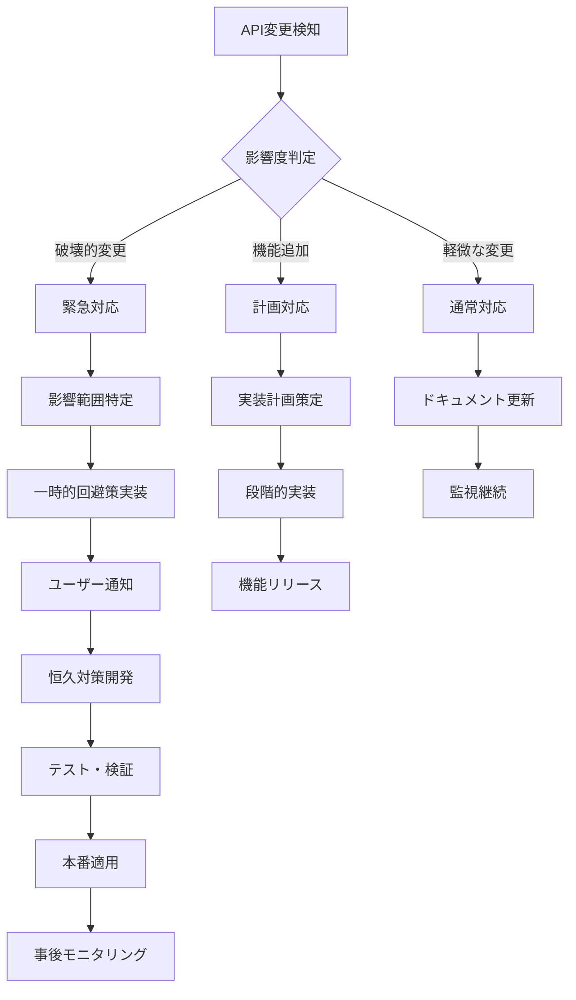
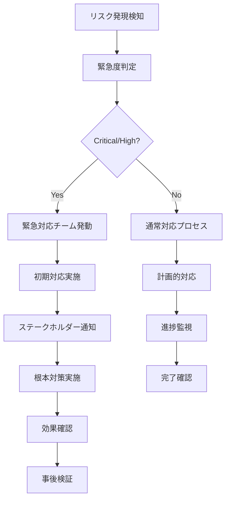

# Omniy リスク管理計画書

> **プロジェクト**: Omniy Instagram予約投稿アプリ  
> **バージョン**: 1.0  
> **作成日**: 2025-01-27  
> **承認者**: Claude PM  
> **ステータス**: 承認済み

---

## 📋 **リスク管理概要**

本文書は、Omniy プロジェクトにおける技術リスク・事業リスクの識別、評価、対策、監視プロセスを定義します。1人運営MVP戦略に基づき、限られたリソースで最大限のリスク軽減を実現します。

### **リスク管理基本方針**
- **予防第一**: リスクの早期識別・対策
- **影響最小化**: ビジネス継続性の確保
- **透明性**: ステークホルダーへの適切な情報共有
- **継続改善**: リスク管理プロセスの定期見直し
- **コスト効率**: 1人運営可能な対策レベル

---

## 🎯 **リスク管理フレームワーク**

### **リスク評価基準**

#### **影響度 (Impact)**
```yaml
Critical (5):
  - 事業継続不可能
  - 全サービス停止
  - 法的責任発生
  - 年間売上50%以上の損失

High (4):
  - 主要機能停止
  - 顧客離反50%以上
  - 重大な信頼失墜
  - 年間売上20-50%の損失

Medium (3):
  - 機能の部分停止
  - 顧客離反10-50%
  - 一時的な信頼失墜
  - 年間売上5-20%の損失

Low (2):
  - 軽微な機能問題
  - 顧客離反5%以下
  - 軽微な評判影響
  - 年間売上1-5%の損失

Very Low (1):
  - 運用上の軽微な問題
  - 顧客影響なし
  - 評判影響なし
  - 売上影響なし
```

#### **発生確率 (Probability)**
```yaml
Very High (5): 90%以上 - ほぼ確実に発生
High (4): 70-90% - 発生する可能性が高い
Medium (3): 30-70% - 発生する可能性がある
Low (2): 10-30% - 発生する可能性は低い
Very Low (1): 10%以下 - ほとんど発生しない
```

#### **リスクスコア計算**
```yaml
Risk Score = Impact × Probability

Critical Risk (20-25): 即座対応必要
High Risk (15-19): 緊急対応必要
Medium Risk (9-14): 計画的対応必要
Low Risk (4-8): 監視継続
Very Low Risk (1-3): 受容可能
```

### **リスク対応戦略**

```yaml
Avoid (回避):
  - リスク要因の除去
  - 代替手段の採用
  - 活動の中止・変更

Mitigate (軽減):
  - 発生確率の低減
  - 影響度の軽減
  - 予防策の実施

Transfer (転嫁):
  - 保険の利用
  - 外部委託
  - 契約による責任転嫁

Accept (受容):
  - リスク受容
  - 緊急対応計画準備
  - 監視継続
```

---

## ⚠️ **技術リスク**

### **Critical/High技術リスク**

#### **TECH-001: Instagram API仕様変更**
```yaml
リスク概要:
  説明: Instagram Graph APIの仕様変更・廃止
  影響: 投稿機能完全停止、サービス継続不可能
  確率: Medium (30-70%)
  影響: Critical (5)
  スコア: 15 (High Risk)

対策:
  予防策:
    - Instagram APIドキュメント定期監視
    - Meta Developer コミュニティ参加
    - API利用規約変更の早期察知
    - 代替API調査・準備

  軽減策:
    - 複数Instagram APIエンドポイント利用
    - API呼び出し分散化
    - レート制限対応強化
    - エラーハンドリング充実

  緊急対応:
    - 48時間以内の代替手段実装
    - ユーザーへの状況説明・代替案提示
    - 手動投稿機能の提供
    - APIバージョン緊急移行

監視指標:
  - API成功率 (>95%で正常)
  - API エラー率の急激な変化
  - Meta公式発表・ニュース
  - 競合サービスの動向

責任者: Claude PM
レビュー頻度: 週次
```

### **Instagram API変更への対応計画**

#### **API変更監視体制**
```yaml
日次監視 (15分):
  監視項目:
    - Graph API成功率・エラー率
    - 新規エラーコード出現
    - レスポンス形式変化
    - Rate Limit変動
  
  監視ツール:
    - 自動監視スクリプト (Cloud Functions)
    - エラーログ解析システム
    - Slackアラート通知
    - ダッシュボード可視化

週次監視 (1時間):
  確認項目:
    - Meta Developer Blog更新
    - API Changelog確認
    - Developer Forum動向
    - 競合サービスAPI対応状況
  
  情報源:
    - https://developers.facebook.com/blog/
    - https://developers.facebook.com/docs/graph-api/changelog
    - Developer Community Forums
    - GitHub Issues (関連プロジェクト)

月次レビュー (2時間):
  分析項目:
    - API利用統計分析
    - エラーパターン分析
    - 新機能・廃止予定確認
    - 代替API調査更新
```

#### **変更検知時の対応フロー**


#### **具体的な対応手順**
```yaml
破壊的変更対応 (24時間以内):
  1. 影響調査 (2時間):
     - 影響を受けるエンドポイント特定
     - 影響ユーザー数算出
     - ビジネス影響評価
  
  2. 暫定対応 (4時間):
     - フォールバック処理実装
     - エラーハンドリング強化
     - 機能の一時無効化検討
  
  3. ユーザー対応 (2時間):
     - 影響ユーザーへの通知
     - 代替手段の案内
     - サポート体制強化
  
  4. 恒久対策 (16時間):
     - 新仕様対応実装
     - 包括的テスト実施
     - 段階的ロールアウト

機能追加対応 (1週間以内):
  1. 機能評価:
     - ユーザー価値評価
     - 実装コスト見積もり
     - 優先順位判定
  
  2. 実装計画:
     - 技術設計
     - テスト計画
     - リリース計画
  
  3. 開発・テスト:
     - 機能実装
     - 単体・結合テスト
     - ユーザー受け入れテスト

軽微な変更対応 (1ヶ月以内):
  1. 影響確認:
     - コード修正箇所特定
     - テスト範囲確認
  
  2. 実装:
     - コード修正
     - テスト実施
     - ドキュメント更新
```

#### **代替案とバックアッププラン**
```yaml
レベル1 - API仕様調整で対応可能:
  対応策:
    - パラメータ調整
    - エンドポイント切り替え
    - レート制限対応強化
  
  実装期間: 1-3日
  影響: 最小限

レベル2 - 大規模仕様変更:
  対応策:
    - アーキテクチャ変更
    - 新APIバージョン移行
    - 機能制限での継続
  
  実装期間: 1-2週間
  影響: 一部機能制限

レベル3 - API廃止・利用不可:
  Plan A - 代替API利用:
    - Instagram Basic Display API
    - Instagram Messaging API
    - サードパーティAPI検討
  
  Plan B - 手動運用支援:
    - 投稿スケジュール管理機能
    - リマインダー通知
    - 手動投稿ガイド提供
  
  Plan C - ピボット:
    - 他SNSプラットフォーム対応
    - コンテンツ管理ツール化
    - マーケティング分析特化
  
  実装期間: 1-3ヶ月
  影響: サービス大幅変更
```

#### **リスク軽減のための技術対策**
```yaml
API抽象化層:
  実装内容:
    - Instagram API wrapper作成
    - 共通インターフェース定義
    - 複数APIバージョン対応
    - モック機能実装
  
  メリット:
    - API変更の影響局所化
    - テスタビリティ向上
    - 切り替え容易性

エラーハンドリング強化:
  実装内容:
    - 詳細なエラー分類
    - 自動リトライ機構
    - フォールバック処理
    - エラー通知システム
  
  メリット:
    - 障害の早期検知
    - 自動復旧率向上
    - ユーザー影響最小化

機能フラグシステム:
  実装内容:
    - 機能別ON/OFF制御
    - ユーザー別段階展開
    - A/Bテスト基盤
    - 緊急停止機能
  
  メリット:
    - リスク分散
    - 段階的移行可能
    - 即座の機能停止

監視・アラート高度化:
  実装内容:
    - ML基盤異常検知
    - 予測的アラート
    - 自動診断システム
    - インシデント自動作成
  
  メリット:
    - 早期問題発見
    - 迅速な対応開始
    - 運用負荷軽減
```

#### **TECH-002: Firebase/GCP障害**
```yaml
リスク概要:
  説明: Firebase/GCPの大規模障害・停止
  影響: システム全停止、データアクセス不可
  確率: Low (10-30%)
  影響: Critical (5)
  スコア: 15 (High Risk)

対策:
  予防策:
    - GCP Status Page定期監視
    - マルチリージョン配置検討
    - Firebase障害履歴分析
    - 外部監視ツール設置

  軽減策:
    - 自動バックアップ強化
    - 障害発生時通知システム
    - 復旧手順書整備
    - ユーザー向け障害情報ページ

  緊急対応:
    - 障害検知から15分以内の初期対応
    - 1時間以内のユーザー通知
    - 復旧見込み時間の定期更新
    - 代替アクセス手段提供

監視指標:
  - Firebase Console アクセス可能性
  - Cloud Functions 実行成功率
  - Firestore 応答時間
  - GCP Status Page ステータス

責任者: Claude PM
レビュー頻度: 日次
```

#### **TECH-003: セキュリティ脆弱性・侵害**
```yaml
リスク概要:
  説明: セキュリティ脆弱性による不正アクセス・データ漏洩
  影響: 個人情報漏洩、法的責任、信頼失墜
  確率: Medium (30-70%)
  影響: Critical (5)
  スコア: 15 (High Risk)

対策:
  予防策:
    - 定期セキュリティスキャン (Trivy, OWASP ZAP)
    - 依存関係脆弱性監視 (Dependabot)
    - セキュリティヘッダー設定
    - 最小権限原則の徹底

  軽減策:
    - WAF設定強化
    - 異常アクセス検知・ブロック
    - 暗号化強化 (保存時・通信時)
    - セキュリティログ監視

  緊急対応:
    - インシデント対応チーム即座招集
    - 影響範囲特定・封じ込め
    - 法的機関への報告 (24時間以内)
    - ユーザーへの透明な情報開示

監視指標:
  - 脆弱性スキャン結果
  - 異常ログイン試行数
  - API 不正アクセス試行
  - セキュリティアラート数

責任者: Claude PM
レビュー頻度: 日次
```

### **Medium技術リスク**

#### **TECH-004: 性能劣化・スケーラビリティ限界**
```yaml
リスク概要:
  説明: ユーザー増加による性能劣化・システム限界
  影響: サービス品質低下、ユーザー離反
  確率: High (70-90%)
  影響: Medium (3)
  スコア: 12 (Medium Risk)

対策:
  予防策:
    - パフォーマンス監視強化
    - 負荷テスト定期実施
    - ボトルネック早期特定
    - キャパシティプランニング

  軽減策:
    - Cloud Functions 最大インスタンス数調整
    - データベースクエリ最適化
    - CDN活用強化
    - キャッシュ戦略改善

  緊急対応:
    - 一時的な機能制限
    - 負荷分散設定調整
    - 緊急スケールアップ
    - ユーザー向け状況説明

監視指標:
  - API応答時間 (>500ms で警告)
  - システムリソース使用率
  - 同時ユーザー数
  - エラー率の変化

責任者: Claude PM
レビュー頻度: 週次
```

#### **TECH-005: データ損失・破損**
```yaml
リスク概要:
  説明: バグ・障害によるユーザーデータ損失・破損
  影響: ユーザー信頼失墜、法的責任
  確率: Low (10-30%)
  影響: High (4)
  スコア: 12 (Medium Risk)

対策:
  予防策:
    - 自動バックアップ (日次)
    - データ整合性チェック
    - トランザクション処理徹底
    - デプロイ前データ検証

  軽減策:
    - Point-in-time リカバリ
    - 地理的冗長バックアップ
    - データ復旧手順書
    - ユーザーデータエクスポート機能

  緊急対応:
    - データ復旧作業即座開始
    - 影響ユーザー特定・連絡
    - 復旧進捗の定期報告
    - 再発防止策実装

監視指標:
  - バックアップ成功率
  - データ整合性チェック結果
  - データベース エラー数
  - ユーザーからのデータ問題報告

責任者: Claude PM
レビュー頻度: 日次
```

#### **TECH-006: 依存関係・供給チェーンリスク**
```yaml
リスク概要:
  説明: 重要な依存ライブラリの開発停止・脆弱性
  影響: 機能停止、セキュリティリスク増大
  確率: Medium (30-70%)
  影響: Medium (3)
  スコア: 9 (Medium Risk)

対策:
  予防策:
    - 依存関係定期監査
    - 代替ライブラリ調査
    - 重要依存関係の最小化
    - ライブラリライセンス確認

  軽減策:
    - 自動更新システム (Dependabot)
    - 脆弱性スキャン自動化
    - フォーク・自社維持検討
    - 段階的移行計画

  緊急対応:
    - 緊急パッチ適用
    - 一時的な機能無効化
    - 代替実装の迅速開発
    - セキュリティアップデート優先

監視指標:
  - 脆弱性アラート数
  - 依存関係更新頻度
  - ライブラリ EOL 情報
  - セキュリティ Advisory

責任者: Claude PM
レビュー頻度: 週次
```

---

## 💼 **事業リスク**

### **Critical/High事業リスク**

#### **BIZ-001: 競合参入・価格競争**
```yaml
リスク概要:
  説明: 大手企業の参入による価格競争・シェア奪取
  影響: 売上大幅減少、事業継続困難
  確率: High (70-90%)
  影響: High (4)
  スコア: 16 (High Risk)

対策:
  予防策:
    - 競合分析定期実施
    - 差別化機能強化
    - 顧客ロイヤルティ向上
    - 特許・商標取得検討

  軽減策:
    - ニッチ市場特化
    - 高付加価値サービス開発
    - 顧客との直接関係強化
    - コスト効率化推進

  緊急対応:
    - 価格戦略見直し
    - 緊急機能開発
    - 既存顧客維持策強化
    - 新市場開拓

監視指標:
  - 競合サービス新規参入情報
  - 市場価格動向
  - 顧客チャーン率
  - 新規獲得コスト変化

責任者: sh (Product Owner)
レビュー頻度: 月次
```

#### **BIZ-002: 法規制変更・コンプライアンス**
```yaml
リスク概要:
  説明: 個人情報保護法・景表法等の規制強化
  影響: 法的責任、罰金、事業停止命令
  確率: Medium (30-70%)
  影響: Critical (5)
  スコア: 15 (High Risk)

対策:
  予防策:
    - 法改正情報の定期収集
    - 弁護士・専門家との顧問契約
    - コンプライアンス体制構築
    - 業界団体への参加

  軽減策:
    - プライバシーポリシー強化
    - データ処理透明性向上
    - ユーザー同意取得徹底
    - 内部監査体制構築

  緊急対応:
    - 専門家との緊急相談
    - システム仕様緊急変更
    - 当局への適切な対応
    - ユーザーへの説明責任

監視指標:
  - 関連法令の改正情報
  - 業界ガイドライン変更
  - 同業他社の法的問題
  - 当局からの指導・通知

責任者: sh (Product Owner)
レビュー頻度: 月次
```

#### **BIZ-003: 資金繰り・キャッシュフロー**
```yaml
リスク概要:
  説明: 売上低迷・コスト増加による資金不足
  影響: 事業継続不可能、サービス停止
  確率: Medium (30-70%)
  影響: Critical (5)
  スコア: 15 (High Risk)

対策:
  予防策:
    - 月次キャッシュフロー管理
    - 複数収益源確保
    - コスト構造最適化
    - 緊急資金調達先確保

  軽減策:
    - 運転資金6ヶ月分確保
    - 変動費比率向上
    - 支払いサイクル最適化
    - 不要コスト削減

  緊急対応:
    - 緊急資金調達実行
    - コスト緊急削減
    - 料金プラン見直し
    - サービス一部停止検討

監視指標:
  - 月次売上・利益
  - キャッシュフロー推移
  - 顧客獲得コスト
  - 運転資金残高

責任者: sh (Product Owner)
レビュー頻度: 週次
```

### **Medium事業リスク**

#### **BIZ-004: キーパーソンリスク (1人運営)**
```yaml
リスク概要:
  説明: 1人運営のため、病気・事故等で事業停止
  影響: 全サービス停止、顧客対応不可
  確率: Low (10-30%)
  影響: Critical (5)
  スコア: 15 (High Risk)

対策:
  予防策:
    - 健康管理徹底
    - 定期健康診断受診
    - 適切な休息・休暇取得
    - ストレス管理

  軽減策:
    - 業務手順書詳細化
    - 緊急時対応手順準備
    - 外部パートナー確保
    - 自動化推進

  緊急対応:
    - 緊急時連絡体制発動
    - 外部パートナーへの業務委託
    - ユーザー向け状況説明
    - サービス一時停止判断

監視指標:
  - 健康状態
  - 作業時間・負荷
  - ストレスレベル
  - 自動化率

責任者: sh (Product Owner)
レビュー頻度: 週次
```

#### **BIZ-005: 市場縮小・需要変化**
```yaml
リスク概要:
  説明: Instagram人気低下・SNS市場の変化
  影響: 需要減少、売上低迷
  確率: Medium (30-70%)
  影響: High (4)
  スコア: 12 (Medium Risk)

対策:
  予防策:
    - SNS市場動向定期分析
    - 顧客ニーズ調査
    - 新プラットフォーム対応検討
    - 市場多様化戦略

  軽減策:
    - 複数SNS対応
    - 付加価値サービス開発
    - ターゲット市場拡大
    - 新規事業検討

  緊急対応:
    - ピボット戦略検討
    - 新プラットフォーム緊急対応
    - 既存顧客維持策強化
    - 新市場開拓加速

監視指標:
  - Instagram MAU 推移
  - 競合プラットフォーム成長
  - 顧客の利用パターン変化
  - 市場調査データ

責任者: sh (Product Owner)
レビュー頻度: 月次
```

#### **BIZ-006: 顧客獲得・維持困難**
```yaml
リスク概要:
  説明: 競争激化による新規獲得困難・既存顧客離反
  影響: 成長停滞、売上目標未達
  確率: High (70-90%)
  影響: Medium (3)
  スコア: 12 (Medium Risk)

対策:
  予防策:
    - 顧客満足度調査定期実施
    - NPS向上施策
    - カスタマーサクセス強化
    - 紹介プログラム構築

  軽減策:
    - オンボーディング改善
    - サポート品質向上
    - 機能改善ロードマップ共有
    - 価格競争力向上

  緊急対応:
    - 顧客離反原因分析
    - 緊急改善施策実施
    - 料金プラン見直し
    - カスタマーサクセス強化

監視指標:
  - 月次チャーン率
  - NPS スコア
  - 顧客サポート満足度
  - 新規獲得コスト

責任者: sh (Product Owner)
レビュー頻度: 月次
```

---

## 🌍 **外部環境リスク**

### **High外部環境リスク**

#### **EXT-001: 経済状況悪化・景気後退**
```yaml
リスク概要:
  説明: 経済不況による企業・個人の IT支出削減
  影響: 新規獲得困難、既存顧客のダウングレード
  確率: Medium (30-70%)
  影響: High (4)
  スコア: 12 (Medium Risk)

対策:
  予防策:
    - 経済指標定期監視
    - 価格弾力性分析
    - コスト効率型価値提案
    - 不況耐性顧客セグメント特定

  軽減策:
    - 低価格プラン提供
    - ROI明確化
    - 必需性アピール強化
    - 契約期間柔軟性向上

  緊急対応:
    - 緊急価格戦略変更
    - フリープラン充実
    - 既存顧客維持重視
    - コスト削減加速

監視指標:
  - GDP成長率
  - IT支出統計
  - 顧客の予算削減情報
  - 同業他社の動向

責任者: sh (Product Owner)
レビュー頻度: 月次
```

#### **EXT-002: 自然災害・パンデミック**
```yaml
リスク概要:
  説明: 大規模災害による事業継続困難
  影響: 一時的事業停止、復旧コスト
  確率: Low (10-30%)
  影響: High (4)
  スコア: 12 (Medium Risk)

対策:
  予防策:
    - BCP (事業継続計画) 策定
    - リモートワーク体制整備
    - 重要データ分散保管
    - 緊急時連絡体制構築

  軽減策:
    - マルチリージョン配置
    - 緊急時対応手順書
    - 外部パートナー体制
    - 保険加入検討

  緊急対応:
    - 安否確認・被害状況把握
    - 緊急時体制発動
    - 顧客向け状況説明
    - 復旧作業優先実施

監視指標:
  - 気象情報・災害警報
  - パンデミック関連情報
  - インフラ被害情報
  - 緊急事態宣言状況

責任者: Claude PM, sh
レビュー頴度: 随時
```

---

## 📊 **リスク監視・評価**

### **リスクダッシュボード**

```typescript
// Risk Management Dashboard
interface RiskMetrics {
  riskId: string;
  category: 'technical' | 'business' | 'external';
  severity: 'critical' | 'high' | 'medium' | 'low';
  probability: number; // 1-5
  impact: number; // 1-5
  riskScore: number; // probability × impact
  status: 'active' | 'mitigated' | 'accepted' | 'transferred';
  lastReview: Date;
  nextReview: Date;
  owner: string;
  mitigationActions: MitigationAction[];
}

interface MitigationAction {
  id: string;
  description: string;
  status: 'planned' | 'in_progress' | 'completed';
  dueDate: Date;
  assignee: string;
  effectiveness: 'high' | 'medium' | 'low';
}

class RiskManagement {
  async getRiskOverview(): Promise<RiskOverview> {
    const allRisks = await this.getAllRisks();
    
    return {
      totalRisks: allRisks.length,
      criticalRisks: allRisks.filter(r => r.riskScore >= 20).length,
      highRisks: allRisks.filter(r => r.riskScore >= 15 && r.riskScore < 20).length,
      mediumRisks: allRisks.filter(r => r.riskScore >= 9 && r.riskScore < 15).length,
      lowRisks: allRisks.filter(r => r.riskScore < 9).length,
      overdue: allRisks.filter(r => r.nextReview < new Date()).length,
      trendAnalysis: this.analyzeRiskTrends(allRisks)
    };
  }

  async generateRiskReport(period: 'weekly' | 'monthly' | 'quarterly'): Promise<RiskReport> {
    const risks = await this.getRisksForPeriod(period);
    
    const report = {
      period,
      executiveSummary: this.generateExecutiveSummary(risks),
      riskMatrix: this.generateRiskMatrix(risks),
      mitigationProgress: this.assessMitigationProgress(risks),
      newRisks: this.identifyNewRisks(risks),
      recommendations: this.generateRecommendations(risks)
    };

    return report;
  }
}
```

### **リスク監視指標**

#### **技術リスク指標**
```yaml
API安定性:
  - Instagram API成功率 (>95%)
  - API エラー率変化
  - レスポンス時間劣化
  - 新規エラータイプ発生

システム性能:
  - 応答時間 (>500ms で警告)
  - エラー率 (>1% で警告)
  - リソース使用率 (>80% で警告)
  - 同時接続数上限接近

セキュリティ:
  - 脆弱性アラート数
  - 異常アクセス試行
  - セキュリティスキャン結果
  - 不正ログイン試行
```

#### **事業リスク指標**
```yaml
市場・競合:
  - 競合新規参入情報
  - 価格競争激化度
  - 市場成長率変化
  - 顧客獲得コスト増加

財務・経営:
  - 月次売上・利益変化
  - キャッシュフロー推移
  - 顧客チャーン率
  - 新規獲得率

法規制:
  - 関連法令改正情報
  - 業界ガイドライン変更
  - 当局指導・通知
  - コンプライアンス監査結果
```

### **リスク評価プロセス**

#### **定期レビュースケジュール**
```yaml
日次監視 (15分):
  - Critical/High リスク指標確認
  - 自動アラート確認
  - 緊急対応要否判断

週次レビュー (1時間):
  - 全リスク状況確認
  - 軽減策進捗確認
  - 新規リスク識別
  - エスカレーション要否判断

月次評価 (2時間):
  - リスクスコア再評価
  - 軽減策効果測定
  - リスク登録簿更新
  - ステークホルダー報告

四半期見直し (4時間):
  - リスク管理戦略見直し
  - 新規リスク識別・評価
  - 軽減策計画更新
  - 外部環境変化対応
```

---

## 🚨 **緊急時対応計画**

### **リスク発現時対応フロー**



### **緊急対応体制**

#### **対応体制・役割分担**
```yaml
インシデント指揮官:
  担当者: Claude PM
  役割: 全体指揮、意思決定、外部連絡
  権限: 緊急支出承認、サービス停止判断

技術対応責任者:
  担当者: Claude PM (兼任)
  役割: 技術的対応実施、復旧作業
  権限: システム変更、緊急デプロイ

事業継続責任者:
  担当者: sh
  役割: 事業影響評価、顧客対応
  権限: 事業判断、顧客向け発表

外部連絡責任者:
  担当者: sh
  役割: 当局・メディア対応、法的手続き
  権限: 公式発表、法的判断
```

#### **エスカレーション基準**
```yaml
Level 1 (通常対応):
  - リスクスコア 1-8
  - 通常業務内で対応
  - 定期報告

Level 2 (注意対応):
  - リスクスコア 9-14
  - 1営業日以内対応
  - 関係者即座報告

Level 3 (緊急対応):
  - リスクスコア 15-19
  - 1時間以内対応開始
  - ステークホルダー緊急連絡

Level 4 (最高優先):
  - リスクスコア 20-25
  - 即座対応開始
  - 経営陣・当局連絡
```

### **事業継続計画 (BCP)**

#### **重要業務の継続性確保**
```yaml
最重要業務 (継続必須):
  - 既存スケジュール実行
  - 顧客データ保護
  - 決済処理継続
  - 緊急サポート対応

重要業務 (4時間以内復旧):
  - 新規スケジュール作成
  - アカウント管理
  - 設定変更機能
  - 一般サポート対応

一般業務 (24時間以内復旧):
  - 統計・分析機能
  - 新機能開発
  - マーケティング活動
  - 非緊急管理業務
```

#### **代替運用手順**
```yaml
技術基盤障害時:
  1. 緊急バックアップシステム起動
  2. 手動投稿支援提供
  3. 顧客への状況説明・代替案提示
  4. 復旧作業並行実施

キーパーソン不在時:
  1. 緊急連絡先への通知
  2. 外部パートナーへの委託
  3. 自動化システム活用
  4. 必要最小限サービス提供

外部API停止時:
  1. 代替API への切り替え
  2. 手動処理による代替
  3. 機能制限での継続
  4. 復旧まで一時停止
```

---

## 📝 **リスク管理文書・記録**

### **リスク登録簿**

#### **リスク登録簿テンプレート**
```yaml
Risk ID: TECH-001
Risk Title: Instagram API仕様変更
Category: Technical
Description: Instagram Graph APIの仕様変更により投稿機能停止

Assessment:
  Probability: 3 (Medium)
  Impact: 5 (Critical)
  Risk Score: 15 (High Risk)
  
Response Strategy: Mitigate
Owner: Claude PM
Review Date: 2025-02-27

Mitigation Actions:
  - Action 1: API監視システム構築
    Status: In Progress
    Due Date: 2025-02-15
    Assignee: Claude PM
    
  - Action 2: 代替API調査・準備
    Status: Planned
    Due Date: 2025-03-31
    Assignee: Claude PM

Monitoring Indicators:
  - Instagram API成功率 (<95%で警告)
  - API エラー率急激増加
  - Meta公式発表監視

Review History:
  - 2025-01-27: Initial assessment (Score: 15)
  - 2025-02-27: Scheduled review
```

### **インシデント記録**

#### **インシデント報告書テンプレート**
```yaml
Incident ID: INC-2025-001
Date: 2025-01-27
Severity: High
Status: Resolved

Summary:
  Brief description of the incident

Timeline:
  Detection: 2025-01-27 14:30 JST
  Initial Response: 2025-01-27 14:45 JST
  Resolution: 2025-01-27 16:30 JST
  Duration: 2 hours

Impact:
  Affected Services: Schedule execution
  Affected Users: 50 users
  Business Impact: ¥100,000 potential revenue loss

Root Cause:
  Primary: Instagram API rate limit exceeded
  Contributing: Insufficient error handling

Resolution:
  Immediate: API rate limiting implementation
  Long-term: Enhanced monitoring system

Lessons Learned:
  1. Need better API monitoring
  2. Error handling improvement required
  3. User notification system enhancement

Prevention Actions:
  - Implement advanced rate limiting
  - Add proactive monitoring alerts
  - Improve error message clarity
```

---

## ✅ **リスク管理承認・効力発効**

### **リスク管理計画承認**
```yaml
リスク管理レビュー:
  作成者: Claude PM
  レビュー日: 2025-01-27
  承認者: sh (Product Owner)
  承認日: 2025-01-27

リスク評価承認:
  - リスク識別: ✅ 16個のリスク識別完了
  - リスク評価: ✅ 確率・影響度評価完了
  - 対策計画: ✅ 軽減策・緊急対応計画承認
  - 監視体制: ✅ 監視指標・プロセス承認

リスク管理体制承認:
  - 責任者: ✅ Claude PM (技術)、sh (事業)
  - レビュー頻度: ✅ 日次・週次・月次・四半期
  - エスカレーション: ✅ 4段階基準承認
  - 緊急対応: ✅ BCP・緊急時体制承認

次回レビュー予定:
  - 週次: 毎週月曜日 (リスク状況確認)
  - 月次: 毎月末 (リスク評価見直し)
  - 四半期: 四半期末 (戦略的見直し)
  - 年次: 年末 (全面的見直し)
```

### **リスク管理実行準備**
```yaml
監視システム準備:
  - [ ] リスク監視ダッシュボード構築
  - [ ] 自動アラート設定
  - [ ] 監視指標データ収集開始
  - [ ] レポート自動生成設定

対応体制準備:
  - [ ] 緊急連絡先整備
  - [ ] 緊急時対応手順書配布
  - [ ] 外部パートナー契約確認
  - [ ] BCP訓練実施

文書管理準備:
  - [ ] リスク登録簿作成
  - [ ] インシデント記録システム設定
  - [ ] 定期レビュー予定設定
  - [ ] ステークホルダー報告体制確立
```

---

**このリスク管理計画書に基づき、プロアクティブなリスク管理を実施します。**  
**継続的な監視・評価・改善により、事業の安定性と成長性を確保していきます。**

---
*Document ID: RISK-001*  
*Classification: Internal*  
*Distribution: sh, Claude PM, Stakeholders*