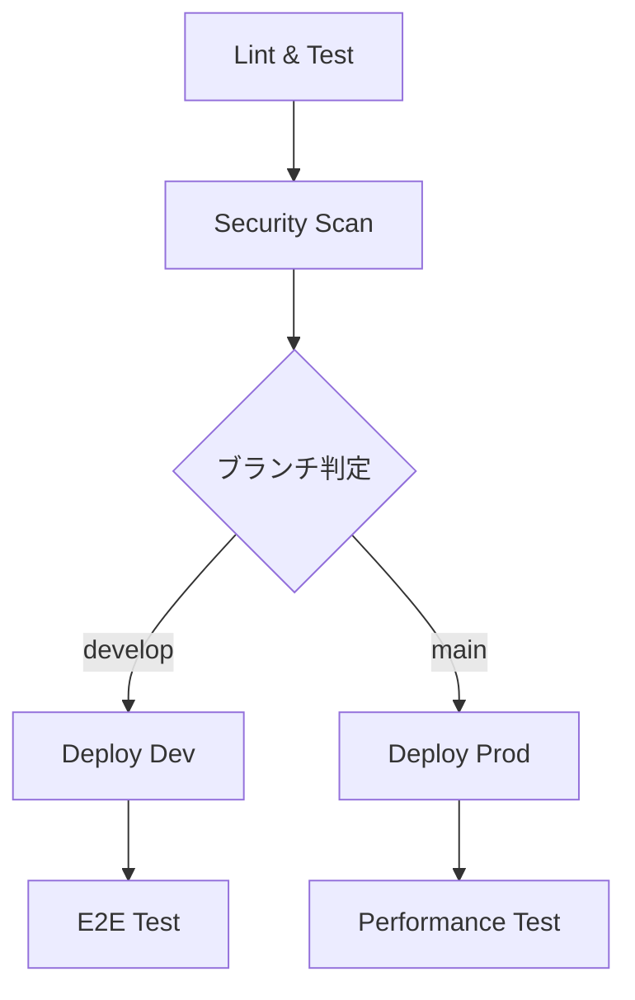

# デプロイメントガイド

> **統合ドキュメント**: CI/CDパイプライン + GitHub Secrets設定  
> **更新**: 2025-01-27

## 概要

OmniyプロジェクトのCI/CDパイプラインと環境設定の完全ガイドです。GitHub Actionsを使用してコード品質の保証、自動テスト、セキュリティスキャン、自動デプロイを実現します。

## 🚀 クイックスタート

### 1. GitHub リポジトリ設定
```bash
# リモートリポジトリ作成・プッシュ
git remote add origin https://github.com/yourusername/omniy.git
git branch -M main
git push -u origin main
```

### 2. Firebase プロジェクト作成
```bash
# 開発環境
firebase projects:create omniy-dev

# 本番環境
firebase projects:create omniy-prod
```

### 3. GitHub Secrets 設定
リポジトリの **Settings** → **Secrets and variables** → **Actions** で以下を設定：

---

## 🔧 GitHub Secrets 設定

### 必須シークレット一覧

#### Firebase関連
```yaml
FIREBASE_TOKEN: # firebase login:ci で取得

# 開発環境用
DEV_FIREBASE_PROJECT_ID: omniy-dev
DEV_FIREBASE_API_KEY: AIzaSyC...
DEV_FIREBASE_AUTH_DOMAIN: omniy-dev.firebaseapp.com
DEV_FIREBASE_STORAGE_BUCKET: omniy-dev.appspot.com
DEV_FIREBASE_MESSAGING_SENDER_ID: 123456789
DEV_FIREBASE_APP_ID: 1:123456789:web:abcdef

# 本番環境用  
PROD_FIREBASE_PROJECT_ID: omniy-prod
PROD_FIREBASE_API_KEY: AIzaSyC...
PROD_FIREBASE_AUTH_DOMAIN: omniy-prod.firebaseapp.com
PROD_FIREBASE_STORAGE_BUCKET: omniy-prod.appspot.com
PROD_FIREBASE_MESSAGING_SENDER_ID: 987654321
PROD_FIREBASE_APP_ID: 1:987654321:web:fedcba
```

#### Claude Code統合 (オプション)
```yaml
ANTHROPIC_API_KEY: sk-ant-api03-... # Claude GitHub App用
```

### Firebase設定値取得手順
1. Firebase Console → プロジェクト設定 → 全般タブ
2. 「アプリ」セクションでWebアプリを選択
3. 「Firebase SDK snippet」→「構成」を選択
4. 設定値をGitHub Secretsに追加

---

## 🏗️ CI/CDパイプライン

### パイプライン構成


### トリガー条件
- `main` ブランチ → 本番環境デプロイ
- `develop` ブランチ → 開発環境デプロイ  
- プルリクエスト → 品質チェックのみ

### 各ジョブの詳細

#### 1. Lint & Test
```yaml
Frontend:
  - ESLint
  - TypeScript型チェック
  - Vitest単体テスト
  - ビルド確認

Backend:
  - ESLint  
  - TypeScript型チェック
  - Jest単体テスト
  - ビルド確認
```

#### 2. Security Scan
- Trivy脆弱性スキャン
- 結果をGitHub Security tabに自動アップロード

#### 3. Deploy Dev (developブランチ)
- 開発環境用の環境変数でビルド
- Firebase HostingとCloud Functionsにデプロイ
- E2Eテスト実行

#### 4. Deploy Prod (mainブランチ)
- 本番環境用の環境変数でビルド
- Firebase HostingとCloud Functionsにデプロイ
- GitHubリリース自動作成

#### 5. Performance Test
- Lighthouse CI実行
- パフォーマンススコア測定

---

## 🌿 ブランチ戦略

### Git Flow ベース
```
main (本番環境)
├── develop (開発環境)
│   ├── feature/新機能A
│   ├── feature/新機能B
│   └── hotfix/緊急修正
└── release/v1.0.0
```

### ワークフロー

#### 機能開発
```bash
git checkout develop
git checkout -b feature/新機能名
# 開発作業
git push origin feature/新機能名
# PR作成 → develop
```

#### 開発環境デプロイ
```bash
# developブランチにマージ後、自動デプロイ
```

#### 本番リリース
```bash
# develop → main のPR作成・マージ
# 自動で本番環境にデプロイ
```

---

## 🌍 環境設定

### 開発環境 (Development)
- Firebase Project: `omniy-dev`
- URL: `https://omniy-dev.web.app`
- 用途: 機能テスト、統合テスト

### 本番環境 (Production)
- Firebase Project: `omniy-prod`
- URL: `https://omniy-prod.web.app`
- 用途: 実際のユーザー向けサービス

---

## ✅ 品質ゲート

### 必須チェック項目
- ✅ ESLint エラーゼロ
- ✅ TypeScript型エラーゼロ
- ✅ 単体テスト成功
- ✅ ビルド成功
- ✅ セキュリティスキャン通過

### 推奨チェック項目
- 📊 コードカバレッジ 80%以上
- 🚀 Lighthouse スコア 90以上
- 🔒 脆弱性ゼロ

---

## 📊 モニタリング

### GitHub Actions
- ワークフロー実行状況の監視
- 失敗時のSlack通知（設定可能）

### Firebase
- Cloud Functions ログ監視
- Hosting パフォーマンス監視
- Firestore 使用量監視

---

## 🐛 トラブルシューティング

### よくある問題

#### 1. ビルドエラー
```bash
# ローカルで確認
cd frontend && npm run build
cd functions && npm run build
```

#### 2. テスト失敗
```bash
# ローカルでテスト実行
cd frontend && npm run test:unit
cd functions && npm run test
```

#### 3. デプロイエラー
- Firebase Token の有効期限確認
- プロジェクト権限の確認
- 環境変数の設定確認

#### 4. Firebase設定エラー
```bash
# Error: Invalid project id
# → FIREBASE_PROJECT_ID の確認

# Error: Permission denied  
# → FIREBASE_TOKEN の有効性確認

# Error: Build failed
# → 各環境の設定値確認
```

### デバッグ手順

1. **GitHub Actions ログ確認**
   - Actions タブで詳細ログを確認
   - エラーメッセージを特定

2. **ローカル再現**
   ```bash
   npm ci
   npm run lint
   npm run test
   npm run build
   ```

3. **環境変数確認**
   - GitHub Secrets の設定確認
   - 環境固有の設定値確認

---

## 🔒 セキュリティ

### シークレット管理
- 絶対にコードにハードコードしない
- ローカル開発では `.env` ファイルを使用
- `.env` ファイルは `.gitignore` に追加済み

### アクセス権限
- Firebase プロジェクトへの適切な権限設定
- 最小権限の原則に従う

### 定期的な更新
- トークンの有効期限を確認
- 定期的にローテーション

---

## 📝 ベストプラクティス

### コミット規約
```
feat: 新機能追加
fix: バグ修正
docs: ドキュメント更新
style: コードスタイル修正
refactor: リファクタリング
test: テスト追加・修正
chore: その他の変更
```

### PR作成時
- 明確なタイトルと説明
- 関連するIssueの参照
- スクリーンショット（UI変更時）
- テスト結果の確認

---

## 🚀 パフォーマンス最適化

### ビルド時間短縮
- npm cache の活用
- 並列実行の最適化
- 不要なステップの削除

### デプロイ時間短縮
- 差分デプロイの活用
- 静的ファイルのキャッシュ
- Cloud Functions の最適化

---

## 🔮 今後の拡張予定

### Phase 2
- Slack 通知統合
- 自動ロールバック機能
- カナリアデプロイ

### Phase 3
- マルチリージョンデプロイ
- A/Bテスト自動化
- パフォーマンス回帰テスト

---

## 📋 設定確認チェックリスト

### 初期設定
- [ ] GitHubリポジトリ作成
- [ ] Firebase プロジェクト作成（dev/prod）
- [ ] GitHub Secrets 設定完了
- [ ] Claude Code統合（オプション）

### 動作確認
- [ ] `develop` ブランチにプッシュ
- [ ] GitHub Actions の実行確認
- [ ] 開発環境へのデプロイ確認  
- [ ] `main` ブランチにマージ
- [ ] 本番環境へのデプロイ確認