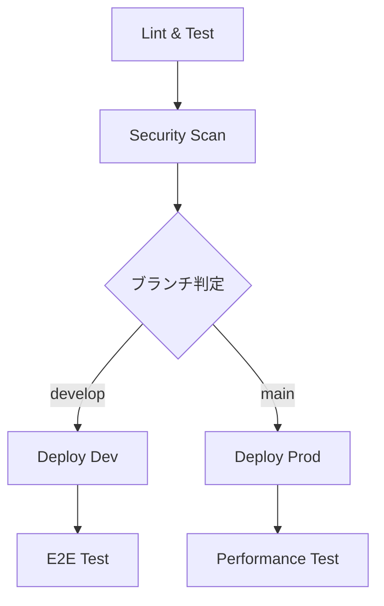

# デプロイメントガイド

> **統合ドキュメント**: CI/CDパイプライン + GitHub Secrets設定  
> **更新**: 2025-01-27

## 概要

OmniyプロジェクトのCI/CDパイプラインと環境設定の完全ガイドです。GitHub Actionsを使用してコード品質の保証、自動テスト、セキュリティスキャン、自動デプロイを実現します。

## 🚀 クイックスタート

### 1. GitHub リポジトリ設定

#### 1.1 GitHubでリポジトリ作成
1. GitHubにログイン
2. 右上の「+」アイコンから「New repository」を選択
3. 以下の設定で作成：
   ```yaml
   Repository name: omniy
   Description: Instagram scheduling app for influencers and small businesses
   Visibility: Private (推奨)
   Initialize repository with: なし（既存コードをプッシュするため）
   ```
4. 「Create repository」をクリック

#### 1.2 ローカルリポジトリの設定
```bash
# 既存のローカルリポジトリに移動
cd /path/to/omniy

# GitHubリモートを追加
git remote add origin https://github.com/yourusername/omniy.git

# ブランチ名をmainに変更（必要な場合）
git branch -M main

# 初回プッシュ
git push -u origin main
```

#### 1.3 ブランチ保護設定
1. GitHubリポジトリの「Settings」→「Branches」
2. 「Add rule」をクリック
3. Branch name pattern: `main`
4. 以下を有効化：
   - Require pull request reviews before merging
   - Require status checks to pass before merging
   - Require branches to be up to date before merging
   - Include administrators
5. 「Create」をクリック

### 2. Firebase プロジェクト作成

#### 2.1 Firebase CLIのインストール・ログイン
```bash
# Firebase CLIをインストール（未インストールの場合）
npm install -g firebase-tools

# Firebaseにログイン
firebase login
```

#### 2.2 開発環境プロジェクト作成
```bash
# プロジェクト作成
firebase projects:create omniy-dev --display-name "Omniy Development"

# プロジェクトディレクトリでFirebase初期化
firebase use omniy-dev
firebase init
# 選択項目:
# - Firestore
# - Functions
# - Hosting
# - Storage
# - Emulators
```

#### 2.3 本番環境プロジェクト作成
```bash
# プロジェクト作成
firebase projects:create omniy-prod --display-name "Omniy Production"

# エイリアス設定
firebase use --add
# Choose alias: prod
# Select project: omniy-prod
```

#### 2.4 Firebase Console設定
各プロジェクトでFirebase Consoleから以下を設定：

1. **Authentication設定**
   - Authentication → Sign-in method
   - 「Google」を有効化
   - サポートメール設定

2. **Firestore設定**
   - Firestore Database → Create database
   - Production modeを選択
   - Location: asia-northeast1 (東京)

3. **Storage設定**
   - Storage → Get started
   - Production modeを選択
   - Location: asia-northeast1 (東京)

4. **Webアプリ登録**
   - Project Overview → Add app → Web
   - App nickname: Omniy Web
   - Firebase Hosting設定: チェック
   - Register app

### 3. GitHub Secrets 設定

#### 3.1 Firebase設定値の取得
1. Firebase Console → プロジェクト設定 → 全般
2. 「マイアプリ」セクションでWebアプリを選択
3. 「SDK設定と構成」→「構成」を選択
4. 表示される設定値をメモ

#### 3.2 Firebase CIトークン取得
```bash
firebase login:ci
# 表示されるトークンをメモ
```

#### 3.3 GitHub Secretsへの登録
1. GitHubリポジトリ → Settings → Secrets and variables → Actions
2. 「New repository secret」をクリック
3. 以下のシークレットを順番に追加：

```yaml
# 共通
FIREBASE_TOKEN: [firebase login:ciで取得したトークン]

# 開発環境
DEV_FIREBASE_PROJECT_ID: omniy-dev
DEV_FIREBASE_API_KEY: [Firebaseコンソールから取得]
DEV_FIREBASE_AUTH_DOMAIN: omniy-dev.firebaseapp.com
DEV_FIREBASE_STORAGE_BUCKET: omniy-dev.appspot.com
DEV_FIREBASE_MESSAGING_SENDER_ID: [Firebaseコンソールから取得]
DEV_FIREBASE_APP_ID: [Firebaseコンソールから取得]

# 本番環境
PROD_FIREBASE_PROJECT_ID: omniy-prod
PROD_FIREBASE_API_KEY: [Firebaseコンソールから取得]
PROD_FIREBASE_AUTH_DOMAIN: omniy-prod.firebaseapp.com
PROD_FIREBASE_STORAGE_BUCKET: omniy-prod.appspot.com
PROD_FIREBASE_MESSAGING_SENDER_ID: [Firebaseコンソールから取得]
PROD_FIREBASE_APP_ID: [Firebaseコンソールから取得]

# Claude Code統合（オプション）
ANTHROPIC_API_KEY: [Claude APIキー]
```

### 4. 環境変数設定

#### 4.1 ローカル開発環境
```bash
# frontend/.env.development
VITE_FIREBASE_PROJECT_ID=omniy-dev
VITE_FIREBASE_API_KEY=[開発環境のAPIキー]
VITE_FIREBASE_AUTH_DOMAIN=omniy-dev.firebaseapp.com
VITE_FIREBASE_STORAGE_BUCKET=omniy-dev.appspot.com
VITE_FIREBASE_MESSAGING_SENDER_ID=[開発環境のSender ID]
VITE_FIREBASE_APP_ID=[開発環境のApp ID]

# functions/.env
FIREBASE_PROJECT_ID=omniy-dev
```

#### 4.2 環境変数テンプレート作成
```bash
# frontend/.env.example
VITE_FIREBASE_PROJECT_ID=your-project-id
VITE_FIREBASE_API_KEY=your-api-key
VITE_FIREBASE_AUTH_DOMAIN=your-auth-domain
VITE_FIREBASE_STORAGE_BUCKET=your-storage-bucket
VITE_FIREBASE_MESSAGING_SENDER_ID=your-sender-id
VITE_FIREBASE_APP_ID=your-app-id
```

### 5. 初回デプロイ確認
```bash
# developブランチ作成・プッシュ
git checkout -b develop
git push -u origin develop

# GitHub Actionsの実行確認
# → GitHubリポジトリのActionsタブで確認

# 開発環境URL確認
# https://omniy-dev.web.app
```

---

## 🔧 GitHub Secrets 設定

### 必須シークレット一覧

#### Firebase関連
```yaml
FIREBASE_TOKEN: # firebase login:ci で取得

# 開発環境用
DEV_FIREBASE_PROJECT_ID: omniy-dev
DEV_FIREBASE_API_KEY: AIzaSyC...
DEV_FIREBASE_AUTH_DOMAIN: omniy-dev.firebaseapp.com
DEV_FIREBASE_STORAGE_BUCKET: omniy-dev.appspot.com
DEV_FIREBASE_MESSAGING_SENDER_ID: 123456789
DEV_FIREBASE_APP_ID: 1:123456789:web:abcdef

# 本番環境用  
PROD_FIREBASE_PROJECT_ID: omniy-prod
PROD_FIREBASE_API_KEY: AIzaSyC...
PROD_FIREBASE_AUTH_DOMAIN: omniy-prod.firebaseapp.com
PROD_FIREBASE_STORAGE_BUCKET: omniy-prod.appspot.com
PROD_FIREBASE_MESSAGING_SENDER_ID: 987654321
PROD_FIREBASE_APP_ID: 1:987654321:web:fedcba
```

#### Claude Code統合 (オプション)
```yaml
ANTHROPIC_API_KEY: sk-ant-api03-... # Claude GitHub App用
```

### Firebase設定値取得手順
1. Firebase Console → プロジェクト設定 → 全般タブ
2. 「アプリ」セクションでWebアプリを選択
3. 「Firebase SDK snippet」→「構成」を選択
4. 設定値をGitHub Secretsに追加

---

## 🏗️ CI/CDパイプライン

### パイプライン構成


### トリガー条件
- `main` ブランチ → 本番環境デプロイ
- `develop` ブランチ → 開発環境デプロイ  
- プルリクエスト → 品質チェックのみ

### 各ジョブの詳細

#### 1. Lint & Test
```yaml
Frontend:
  - ESLint
  - TypeScript型チェック
  - Vitest単体テスト
  - ビルド確認

Backend:
  - ESLint  
  - TypeScript型チェック
  - Jest単体テスト
  - ビルド確認
```

#### 2. Security Scan
- Trivy脆弱性スキャン
- 結果をGitHub Security tabに自動アップロード

#### 3. Deploy Dev (developブランチ)
- 開発環境用の環境変数でビルド
- Firebase HostingとCloud Functionsにデプロイ
- E2Eテスト実行

#### 4. Deploy Prod (mainブランチ)
- 本番環境用の環境変数でビルド
- Firebase HostingとCloud Functionsにデプロイ
- GitHubリリース自動作成

#### 5. Performance Test
- Lighthouse CI実行
- パフォーマンススコア測定

---

## 🌿 ブランチ戦略

### Git Flow ベース
```
main (本番環境)
├── develop (開発環境)
│   ├── feature/新機能A
│   ├── feature/新機能B
│   └── hotfix/緊急修正
└── release/v1.0.0
```

### ワークフロー

#### 機能開発
```bash
git checkout develop
git checkout -b feature/新機能名
# 開発作業
git push origin feature/新機能名
# PR作成 → develop
```

#### 開発環境デプロイ
```bash
# developブランチにマージ後、自動デプロイ
```

#### 本番リリース
```bash
# develop → main のPR作成・マージ
# 自動で本番環境にデプロイ
```

---

## 🌍 環境設定

### 開発環境 (Development)
- Firebase Project: `omniy-dev`
- URL: `https://omniy-dev.web.app`
- 用途: 機能テスト、統合テスト

### 本番環境 (Production)
- Firebase Project: `omniy-prod`
- URL: `https://omniy-prod.web.app`
- 用途: 実際のユーザー向けサービス

---

## ✅ 品質ゲート

### 必須チェック項目
- ✅ ESLint エラーゼロ
- ✅ TypeScript型エラーゼロ
- ✅ 単体テスト成功
- ✅ ビルド成功
- ✅ セキュリティスキャン通過

### 推奨チェック項目
- 📊 コードカバレッジ 80%以上
- 🚀 Lighthouse スコア 90以上
- 🔒 脆弱性ゼロ

---

## 📊 モニタリング

### GitHub Actions
- ワークフロー実行状況の監視
- 失敗時のSlack通知（設定可能）

### Firebase
- Cloud Functions ログ監視
- Hosting パフォーマンス監視
- Firestore 使用量監視

---

## 🐛 トラブルシューティング

### よくある問題

#### 1. ビルドエラー
```bash
# ローカルで確認
cd frontend && npm run build
cd functions && npm run build
```

#### 2. テスト失敗
```bash
# ローカルでテスト実行
cd frontend && npm run test:unit
cd functions && npm run test
```

#### 3. デプロイエラー
- Firebase Token の有効期限確認
- プロジェクト権限の確認
- 環境変数の設定確認

#### 4. Firebase設定エラー
```bash
# Error: Invalid project id
# → FIREBASE_PROJECT_ID の確認

# Error: Permission denied  
# → FIREBASE_TOKEN の有効性確認

# Error: Build failed
# → 各環境の設定値確認
```

### デバッグ手順

1. **GitHub Actions ログ確認**
   - Actions タブで詳細ログを確認
   - エラーメッセージを特定

2. **ローカル再現**
   ```bash
   npm ci
   npm run lint
   npm run test
   npm run build
   ```

3. **環境変数確認**
   - GitHub Secrets の設定確認
   - 環境固有の設定値確認

---

## 🔒 セキュリティ

### シークレット管理
- 絶対にコードにハードコードしない
- ローカル開発では `.env` ファイルを使用
- `.env` ファイルは `.gitignore` に追加済み

### アクセス権限
- Firebase プロジェクトへの適切な権限設定
- 最小権限の原則に従う

### 定期的な更新
- トークンの有効期限を確認
- 定期的にローテーション

---

## 📝 ベストプラクティス

### コミット規約
```
feat: 新機能追加
fix: バグ修正
docs: ドキュメント更新
style: コードスタイル修正
refactor: リファクタリング
test: テスト追加・修正
chore: その他の変更
```

### PR作成時
- 明確なタイトルと説明
- 関連するIssueの参照
- スクリーンショット（UI変更時）
- テスト結果の確認

---

## 🚀 パフォーマンス最適化

### ビルド時間短縮
- npm cache の活用
- 並列実行の最適化
- 不要なステップの削除

### デプロイ時間短縮
- 差分デプロイの活用
- 静的ファイルのキャッシュ
- Cloud Functions の最適化

---

## 🔮 今後の拡張予定

### Phase 2
- Slack 通知統合
- 自動ロールバック機能
- カナリアデプロイ

### Phase 3
- マルチリージョンデプロイ
- A/Bテスト自動化
- パフォーマンス回帰テスト

---

## 📋 設定確認チェックリスト

### 初期設定
- [ ] GitHubリポジトリ作成
- [ ] Firebase プロジェクト作成（dev/prod）
- [ ] GitHub Secrets 設定完了
- [ ] Claude Code統合（オプション）

### 動作確認
- [ ] `develop` ブランチにプッシュ
- [ ] GitHub Actions の実行確認
- [ ] 開発環境へのデプロイ確認  
- [ ] `main` ブランチにマージ
- [ ] 本番環境へのデプロイ確認